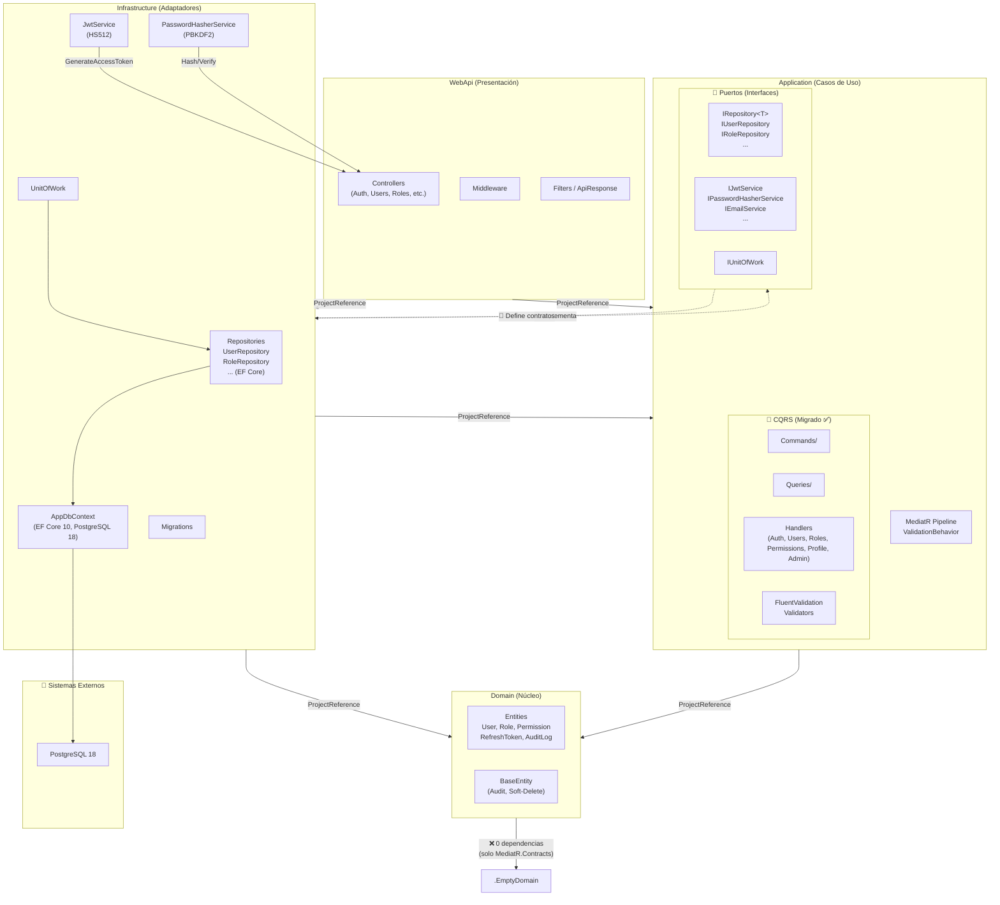
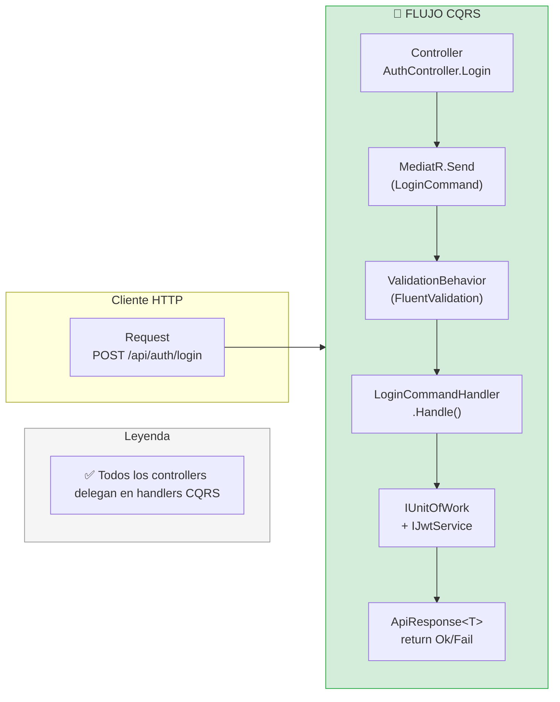

# User Management Platform — Agent Guide

## ⚠️ REGLA DE ORO — Mandatory for ALL agents

> **Ningún cambio debe aplicarse sin antes verificar explícitamente que la funcionalidad original tiene un test unitario que la cubra. Si no lo tiene, se debe crear el test, validar que funcione (`dotnet test`), y luego aplicar el cambio. Esto previene regresiones y asegura que el comportamiento original se preserve.**

User management platform with RBAC. .NET 10 (hexagonal/CQRS), React 19 + shadcn/ui + Tailwind v4. PostgreSQL 18, JWT auth with refresh rotation, rate limiting.

## Project Structure
- `src/backend/` — .NET 10 solution
  - `Domain/` — Entities, ValueObjects, Enums, Common
  - `Application/` — Commands, Queries, Validators, Interfaces (MediatR, FluentValidation, AutoMapper)
  - `Infrastructure/` — Persistence (EF Core), Identity, Email, Services
  - `WebApi/` — Controllers, Middleware, Filters, Program.cs
- `src/frontend/` — React 19 + Vite + TypeScript + Tailwind v4 + shadcn/ui
  - `stores/` — Zustand (auth-store)
  - `lib/` — API client (axios), utilities
  - `components/ui/` — shadcn/ui (button, card, input, etc.)
  - `components/layout/` — Sidebar, header
  - `components/auth/` — Auth guards
  - `pages/` — Login, dashboard, users, roles, permissions
- `src/docker/` — Dockerfiles, nginx.conf, docker-compose.yml
- `src/backend/` — xUnit + Moq + FluentAssertions tests inside backend
- `.opencode/` — OpenSpec skills and config

## Quick Start
```bash
# 1. PostgreSQL
docker run -d --name mvp-postgres -e POSTGRES_DB=mvp-usuarios-db -e POSTGRES_USER=mvp-usuarios-db -e POSTGRES_PASSWORD=mvp-usuarios-dev-2024 -p 5432:5432 postgres:18-alpine

# 2. Backend (http://localhost:5011)
dotnet run --project src/backend/AppBaseNetReact.WebApi --launch-profile http

# 3. Frontend (http://localhost:5173)
cd src/frontend && npm run dev
```
- API: `http://localhost:5011/api/...` — Scalar UI: `/scalar/v1`
- Admin: `admin@sistema.local` / `admin` (force password change on first login)
- DB + seed data auto-applied on startup
- Frontend proxies `/api` → `http://localhost:5011`

## Key Commands
```bash
dotnet build AppBaseNetReact.slnx                          # Build backend
dotnet test AppBaseNetReact.slnx                           # Run all tests
cd src/frontend && npm run build                           # Build frontend
docker compose -f src/docker/docker-compose.yml up -d      # Full stack + Traefik
dotnet ef migrations add <Name> -p src/backend/AppBaseNetReact.Infrastructure -s src/backend/AppBaseNetReact.WebApi
dotnet ef database update -p src/backend/AppBaseNetReact.Infrastructure -s src/backend/AppBaseNetReact.WebApi
```

## Diagrama de Arquitectura — Dependencias y Flujo de Ejecución

> ⚠️ **Este diagrama debe mantenerse actualizado.** Cada vez que se modifique la estructura de capas, dependencias entre proyectos, o el flujo de ejecución (ej: agregar un handler CQRS, cambiar un puerto, añadir un adaptador), el desarrollador debe actualizar este diagrama en `AGENTS.md` y `README.md`.

### Dependencias entre Capas (Project References)



### Flujo de Ejecución — CQRS



### ¿Dónde ocurre la acción?

| Aspecto | ¿Dónde está ahora? | ¿Dónde debería estar (CQRS)? |
|---------|-------------------|------------------------------|
| **Orquestación de negocio (Login)** | ✅ `Application/Features/Auth/Commands/Login/LoginCommandHandler.cs` — migrado en `openspec/changes/cqrs-auth-login/` | Mismo lugar ✅ |
| **Orquestación de negocio (Refresh + Logout)** | ✅ `Application/Features/Auth/Commands/Refresh/RefreshCommandHandler.cs` + `Application/Features/Auth/Commands/Logout/LogoutCommandHandler.cs` — migrado en `openspec/changes/cqrs-auth-refresh/` | Mismo lugar ✅ |
| **Orquestación de negocio (ChangePassword/ForgotPassword/ResetPassword)** | ✅ `Application/Features/Auth/Commands/ChangePassword/ChangePasswordCommandHandler.cs` + `ForgotPassword/ForgotPasswordCommandHandler.cs` + `ResetPassword/ResetPasswordCommandHandler.cs` — migrado en `openspec/changes/cqrs-auth-password/` | Mismo lugar ✅ |
| **Orquestación de negocio (ConfirmEmail)** | ✅ `Application/Features/Auth/Commands/ConfirmEmail/ConfirmEmailCommandHandler.cs` — migrado en `openspec/changes/cqrs-auth-confirm-email/` | Mismo lugar ✅ |
| **Orquestación de negocio (CreateUser — token + email confirmation)** | ✅ `Application/Features/Users/Commands/CreateUser/CreateUserCommandHandler.cs` — migrado en `openspec/changes/cqrs-users-management/`. Spec: `openspec/specs/user-creation/spec.md` (12 requirements: 5 de email-confirmation, 2 de frontend-link, 3 de secure-onboarding, 2 de no-delete + partial-unique). | Mismo lugar ✅ |
| **Orquestación de negocio (ResendOnboardingEmail)** | ✅ `Application/Features/Users/Commands/ResendOnboardingEmail/ResendOnboardingEmailCommandHandler.cs` (regenera token, publica `OnboardingEmailResentNotification`, fuerza reenvío solo si el usuario aún no confirmó) — implementado en `openspec/changes/2026-06-06-secure-user-onboarding/`. Endpoint: `POST /api/users/{id}/resend-onboarding-email` con mapping 200/404/409. | Mismo lugar ✅ |
| **Orquestación de negocio (Roles CRUD)** | ✅ `Application/Features/Roles/Commands/{CreateRole,UpdateRole,DeleteRole,UpdatePermissions}CommandHandler.cs` + `Application/Features/Roles/Queries/{GetRoles,GetRole,GetUsersByRole}QueryHandler.cs` — migrado en `openspec/changes/2026-06-03-user-role-management/` + `openspec/changes/2026-06-09-fase3-backend-completion/`. | Mismo lugar ✅ |
| **Orquestación de negocio (Permissions — GetPermissions/GetModules)** | ✅ `Application/Features/Permissions/Queries/{GetPermissions,GetModules}QueryHandler.cs` — migrado en commit `6025b2b`. | Mismo lugar ✅ |
| **Orquestación de negocio (Profile — GetProfile/GetActivity/UpdateProfile/UploadAvatar)** | ✅ `Application/Features/Profile/Commands/{UpdateProfile,UploadAvatar}CommandHandler.cs` + `Application/Features/Profile/Queries/{GetProfile,GetActivity}QueryHandler.cs` — migrado en commit `4553045`. | Mismo lugar ✅ |
| **Orquestación de negocio (Admin — Dashboard/AuditLog/RevokeTokens/TestEmail)** | ✅ `Application/Features/Admin/Queries/{GetDashboard,GetAuditLog}QueryHandler.cs` + `Application/Features/Admin/Commands/{RevokeAllTokens,SendTestEmail}CommandHandler.cs` — migrado en commit `80eaa73`. | Mismo lugar ✅ |
| **Validación de input** | `Application/Common/Validators/{AuthValidators,RoleValidators,UserValidators}.cs` | Mismo lugar ✅ |
| **Lógica de dominio** | `Domain/Entities/User.cs` — `MarkLogin()`, `LockUntil()`, etc. | Mismo lugar ✅ (invocado desde el handler) |
| **Persistencia** | `Infrastructure/Persistence/Repositories/` + `UnitOfWork` | Mismo lugar ✅ |
| **Pipeline de validación** | ✅ `Application/Common/Behaviors/ValidationBehavior.cs` — activo para Auth, Users y Roles | Mismo lugar ✅ |
| **DTOs/Response** | ✅ Definidos en cada feature (`LoginResponse.cs`, `GetUsersResponse.cs`, `CreateUserResponse.cs`, etc.) | Mismo lugar ✅ |

### Reglas Arquitectónicas
- **Domain:** Zero external dependencies
- **Application:** Only depends on Domain + NuGet (MediatR, FluentValidation, AutoMapper)
- **Infrastructure:** Implements Application interfaces, depends on Domain
- **WebApi:** References Application + Infrastructure (pragmatic hexagonal)
- Controllers inject `IUnitOfWork` and services, never repositories directly
- CQRS: each feature = Command/Query → Handler → Validator → DTO/Response
- Soft-delete with global query filters, repository pattern with UnitOfWork
- JWT access (short-lived) + refresh token rotation (SHA-256 hashed + `FixedTimeEquals`)
- Permission-based authorization via JWT claims, CSRF protection via JWT
- Rate limiting with named policies (Login: 10/min, ForgotPassword: 3/hr)
- Account lockout: 5 failed attempts → 15 min lock
- Anti-enumeration: same message for invalid email vs wrong password
- Frontend: Zustand for state, axios for HTTP, `cn()` utility with `clsx` + CVA

## Environment Variables
| Variable | Description |
|----------|-------------|
| `ConnectionStrings__PostgreSQL` | Postgres connection string |
| `Jwt__SecretKey` | Signing key (min 64 chars) |
| `Jwt__Issuer` / `Jwt__Audience` | Token issuer / audience URL |
| `Captcha__SiteKey` / `Captcha__SecretKey` | Cloudflare Turnstile keys |
| `Email__Smtp__Username` / `Email__Smtp__Password` | SMTP credentials |

## Conventions
- Frontend: kebab-case for files/folders, PascalCase for C# classes/files
- All API responses use `ApiResponse<T>` wrapper
- Tests mirror source: `src/backend/AppBaseNetReact.*.Tests/`
- Use `@theme` for Tailwind tokens (OKLCH), dark/light mode via CSS variables
- Form validation: FluentValidation (backend) + React Hook Form + Zod (frontend)
- Security headers middleware: CSP, X-Frame-Options, etc.

## Database
- PostgreSQL 18, EF Core 10 Code-First
- Database: `mvp-usuarios-db` / User: `mvp-usuarios-db`
- Password: random generated, stored in `.env` (gitignored)

## Agent Roles

### 🧠 PRODUCT OWNER
- **Focus:** Requirements, priorities, business value. Input: `planInicial.ia.md`, user feedback. Output: specs, acceptance criteria, priority matrix. Questions: problem scope, MVP, user story. Guardrails: does not code or design architecture.

### 🏗️ DEVELOPER
- **Focus:** Backend/frontend implementation, code quality. Entity/DTO/Controller, repository/service layer, EF migrations, API contracts, Zustand/Axios integration, CQRS with MediatR, FluentValidation + Zod validation.
- **Key patterns:** Hexagonal architecture (Domain→Application→Infrastructure→WebApi), repository + UnitOfWork, soft-delete global filters, JWT refresh rotation, rate limiting.
- **Files:** `src/backend/`, `stores/`, `lib/`

### 🏛️ ARQUITECTO DE SOFTWARE (HEXAGONAL)
- **Focus:** Integridad arquitectónica, aplicación estricta de las reglas hexagonales, contratos entre capas, diseño de agregados, eventos de dominio, contratos puerto/adaptador. Revisa que Domain tenga cero dependencias externas, Application solo dependa de Domain, e Infrastructure implemente los puertos. Aprueba cambios cross-layer.
- **Key patterns:** Hexagonal architecture (Ports/Adapters), aggregate roots, domain events, value objects, CQRS separation, boundary enforcement, anti-corruption layers, arch unit tests.
- **Files:** `src/backend/Domain/`, `src/backend/Application/Common/Interfaces/`, `src/backend/Infrastructure/`, `.slnx`, architecture tests

### 🎨 UX/UI
- **Focus:** Component architecture, design system, accessibility, responsive. shadcn/ui customization, Tailwind v4 (OKLCH, `@theme`), layout shell (sidebar, header), form UX (RHF+Zod), session countdown modal, dark/light mode (future).
- **Key patterns:** `cn()` with `clsx`+CVA, `@base-ui/react` primitives, collapsible sidebar (localStorage), consistent spacing/tokens/typography.
- **Files:** `src/frontend/src/components/`, `index.css`

### 🧪 QA
- **Focus:** Test coverage, edge cases, regression prevention. Unit tests (xUnit+Moq+FluentAssertions), integration tests with Testcontainers (future), Vitest+Testing Library (future), coverlet code coverage.
- **Key patterns:** `Mock<IUnitOfWork>`, controller tests with mocked `HttpContext`+`ClaimsPrincipal`, domain entity behavior tests, FluentValidation rule tests.
- **Files:** `src/backend/AppBaseNetReact.*.Tests/`

### 🔒 SECURITY AUDIT
- **Focus:** Authentication, authorization, data protection, OWASP. JWT (HS512, short-lived, refresh rotation), rate limiting (Login 10/min, ForgotPassword 3/hr), account lockout (5→15min), password policy, security headers (CSP, X-Frame-Options), audit logging, anti-enumeration, SQL injection prevention (EF parameterized), CSRF via JWT.
- **Key patterns:** `[EnableRateLimiting("Login")]`, IP+User-Agent audit logs, SHA-256 hashing + `FixedTimeEquals` for refresh tokens, permission-based JWT claims.
- **Files:** `WebApi/Middleware/`, `WebApi/Controllers/AuthController.cs`

### 🚀 DEVOPS
- **Focus:** CI/CD, Docker, deployment, monitoring, secrets. Multi-stage builds (SDK→runtime, Node→nginx), Docker Compose (Traefik+PostgreSQL+backend+frontend), nginx SPA routing+asset caching, Traefik TLS (Let's Encrypt), env vars (.env template), Serilog (Console+File, future: PostgreSQL/Prometheus), health checks (`/health`, `/health/ready`), `.gitignore`.
- **Key patterns:** `condition: service_healthy`, label-based Traefik routing, Alpine images.
- **Files:** `src/docker/`, `.env.template`, `docker-compose*.yml`

## Workflow Phases

### Phase 1: Exploration (`/opsx-explore`)
[PRODUCT OWNER] defines problem+scope → [SECURITY AUDIT] identifies risks → [DEVELOPER]+[ARQUITECTO]+[UX/UI] research feasibility → [QA] plans tests → [DEVOPS] assesses infrastructure.

### Phase 2: Proposal (`/opsx-propose`)
[PRODUCT OWNER] → proposal.md (what+why) | [DEVELOPER]+[ARQUITECTO] → design.md (architecture+decisions) | [QA] → tasks.md (test plan) | All → `.openspec.yaml`

### Phase 3: Implementation (`/opsx-apply`)
For each task: [DEVELOPER] implements + adds decision comments → [QA] verifies + adds tests → [ARQUITECTO] reviews architecture compliance → [SECURITY AUDIT] reviews → [UX/UI] reviews frontend → [DEVOPS] checks docker/deploy → mark `- [x]`.

### Phase 4: Archive (`/opsx-archive`)
[QA] runs full suite → [SECURITY AUDIT] signs off → [DEVOPS] deploys to staging → [PRODUCT OWNER] accepts → archive.

## Communication Protocol
| Trigger | Action |
|---------|--------|
| Ambiguous requirement | Escalate to PRODUCT OWNER via `question` tool |
| Security concern | Pause, engage SECURITY AUDIT |
| Breaking test | Pause, engage QA + DEVELOPER |
| Infrastructure change | Notify DEVOPS for docker/deploy review |
| Architecture violation | Pause, engage ARQUITECTO + DEVELOPER |
| UI/UX decision | Consult UX/UI before implementing |
| Cross-cutting change | All agents review in sequence before commit |

## Decision Log
Every significant decision must be documented with: **Context** → **Options** → **Decision** → **Rationale** → **Trade-offs** → **Date**.
