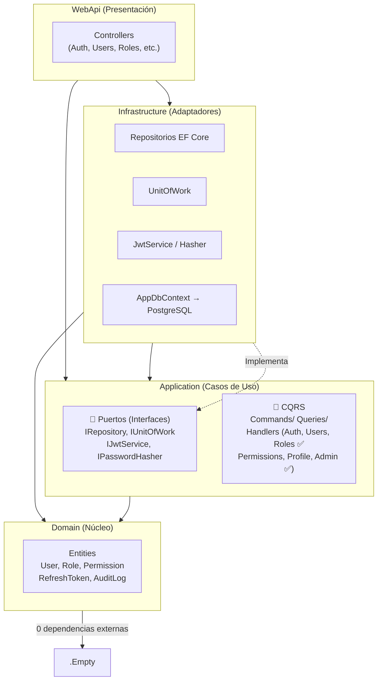
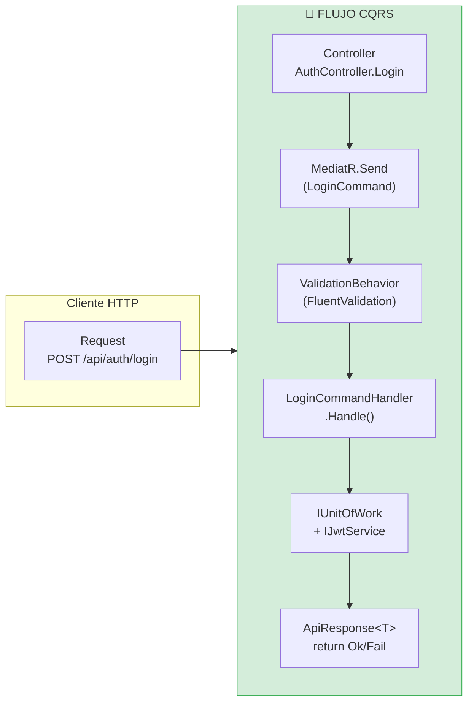

# User Management Platform

Plataforma de gestión de usuarios con autenticación JWT, RBAC (Role-Based Access Control), autenticación social (Google / GitHub OAuth 2.0), y despliegue Docker con Traefik.

> **⚠️ Regla de Oro**
>
> Ningún cambio debe aplicarse sin antes verificar explícitamente que la funcionalidad original tiene un test unitario que la cubra. Si no lo tiene, se debe crear el test, validar que funcione (`dotnet test`), y luego aplicar el cambio. Esto previene regresiones y asegura que el comportamiento original se preserve.

---

## 📑 Tabla de Contenidos

- [Stack Tecnológico](#-stack-tecnológico)
- [Requisitos](#-requisitos)
- [Inicio Rápido](#-inicio-rápido-desarrollo-local)
- [Estructura del Proyecto](#-estructura-del-proyecto)
- [Arquitectura](#-arquitectura)
- [API Endpoints](#-api-endpoints)
- [Seguridad](#-seguridad)
- [Seed Data](#-seed-data)
- [Testing](#-testing)
- [Variables de Entorno](#-variables-de-entorno)
- [Comandos Principales](#-comandos-principales)
- [Despliegue](#-despliegue)
- [OAuth 2.0 — Google](#-oauth-20--google)
- [OAuth 2.0 — GitHub](#-oauth-20--github)
- [Acceso a Base de Datos](#-acceso-a-base-de-datos-seguro)
- [Sincronización Git](#-sincronización-de-historial-en-caso-de-git-force-push)
- [Documentación Adicional](#-documentación-adicional)

---

## 🛠 Stack Tecnológico

| Capa | Tecnología |
|------|------------|
| **Backend** | .NET 10, C# 13, ASP.NET Core Controllers |
| **Arquitectura** | Hexagonal (Domain / Application / Infrastructure / WebApi), CQRS con MediatR |
| **ORM** | Entity Framework Core 10, PostgreSQL 18 |
| **Autenticación** | JWT (HS512) con refresh token rotation + reuse detection |
| **OAuth Social** | Google OAuth 2.0 (OpenID Connect) + GitHub OAuth 2.0 |
| **Hashing** | PBKDF2 (Rfc2898DeriveBytes, 100k iteraciones) |
| **Validación (backend)** | FluentValidation + MediatR Pipeline |
| **Frontend** | React 19, Vite 8, TypeScript, Tailwind CSS v4, shadcn/ui v4 |
| **Estado (frontend)** | Zustand |
| **Validación (frontend)** | React Hook Form + Zod |
| **HTTP Client** | Axios con interceptor de refresh automático |
| **Proxy inverso** | Traefik v3 con Let's Encrypt (TLS automático) |
| **Testing** | xUnit + Moq + FluentAssertions |
| **Contenedores** | Docker Compose, imágenes Alpine multi-stage |

---

## 📋 Requisitos

- .NET 10 SDK
- Node.js 22+
- Docker + Docker Compose
- PostgreSQL 18 (o usar el contenedor del docker-compose)

---

## 🚀 Inicio Rápido (desarrollo local)

### Opción 1 — Script automático (recomendado)

Levanta PostgreSQL, backend y frontend con un solo comando:

**Windows:**
```cmd
start.bat
```

**Linux / macOS:**
```bash
chmod +x start.sh
./start.sh
```

El script automáticamente:
1. Inicia PostgreSQL 18 (contenedor Docker)
2. Lanza el backend en `http://localhost:5011`
3. Lanza el frontend en `http://localhost:5173`

### Opción 2 — Manual paso a paso

```bash
# 1. Clonar y configurar variables de entorno
cp .env.template .env
# Editar .env con valores reales
# La clave JWT debe tener al menos 64 caracteres

# 2. Configurar secretos locales (nunca en appsettings.json)
dotnet user-secrets init --project src/backend/AppBaseNetReact.WebApi
dotnet user-secrets set "Email:Smtp:Host" "smtp.gmail.com" --project src/backend/AppBaseNetReact.WebApi
dotnet user-secrets set "Email:Smtp:Username" "tu-email@gmail.com" --project src/backend/AppBaseNetReact.WebApi
dotnet user-secrets set "Email:Smtp:Password" "tu-passphrase" --project src/backend/AppBaseNetReact.WebApi
dotnet user-secrets set "Email:FromEmail" "tu-email@gmail.com" --project src/backend/AppBaseNetReact.WebApi
dotnet user-secrets set "FrontendUrl" "http://localhost:5173" --project src/backend/AppBaseNetReact.WebApi

# 3. Iniciar PostgreSQL (opcional, si no tienes local)
docker compose -f src/docker/docker-compose.yml up postgres -d

# 4. Backend (http://localhost:5011)
dotnet build app-base-net-react.slnx
dotnet run --project src/backend/AppBaseNetReact.WebApi

# 5. Frontend (http://localhost:5173)
cd src/frontend
npm install
npm run dev
```

### Credenciales por defecto

| Dato | Valor |
|------|-------|
| **Email** | `admin@sistema.local` |
| **Password** | `admin` |
| **Rol** | SuperAdmin |
| **Nota** | Se exige cambiar contraseña en el primer ingreso |

### URLs de desarrollo

| Servicio | URL |
|----------|-----|
| Frontend | `http://localhost:5173` |
| Backend API | `http://localhost:5011/api/...` |
| Scalar UI (documentación API) | `http://localhost:5011/scalar/v1` |

---

## 📁 Estructura del Proyecto

```
├── app-base-net-react.slnx           # Solución .NET (formato SLNX)
├── .env.template                     # Template de variables de entorno
├── start.bat / start.sh              # Scripts de inicio rápido (Windows / Linux)
├── AGENTS.md                         # Guía multi-agente para asistentes IA
├── DESIGN.md                         # Architecture Decision Records (ADRs)
├── src/
│   ├── backend/
│   │   ├── AppBaseNetReact.Domain/              # Entidades, Value Objects, Enums (0 dependencias externas)
│   │   ├── AppBaseNetReact.Application/         # CQRS, Interfaces, Validación FluentValidation
│   │   ├── AppBaseNetReact.Infrastructure/      # EF Core, JWT, Email, Repositories, UnitOfWork
│   │   ├── AppBaseNetReact.WebApi/              # Controllers, Middleware, Program.cs, Filters
│   │   ├── AppBaseNetReact.Application.Tests/   # Unit tests — handlers, validadores
│   │   └── AppBaseNetReact.WebApi.Tests/        # Controller tests
│   ├── frontend/                                # React 19 + Vite 8
│   │   ├── src/stores/                          # Zustand (auth-store)
│   │   ├── src/lib/                             # API client (Axios), utils
│   │   ├── src/hooks/                           # Custom React hooks
│   │   ├── src/components/ui/                   # shadcn/ui v4 primitives
│   │   ├── src/components/layout/               # Layout, Sidebar, Header
│   │   ├── src/components/auth/                 # Auth guards (SessionWarning)
│   │   └── src/pages/                           # Login, Dashboard, Users, Roles, Permissions,
│   │                                            # Profile, Admin, Público, OAuth callback...
│   └── docker/                                  # Dockerfiles, nginx.conf, docker-compose.yml
```

---

## 🏗 Arquitectura

> ⚠️ **Este diagrama debe mantenerse actualizado.** Cada vez que se modifique la estructura de capas, dependencias entre proyectos, o el flujo de ejecución, actualizar este diagrama en `README.md` y `AGENTS.md`.

### Dependencias entre Capas



### CQRS — Estado de migración

Todos los controladores están migrados a CQRS: inyectan solo `IMediator` y delegan la lógica de negocio a handlers en `Application/Features/`.

| Módulo | Ubicación |
|--------|-----------|
| Auth (login, refresh, logout, password, confirm-email) | `Application/Features/Auth/Commands/` |
| Users (CRUD, onboarding, avatar, import/export) | `Application/Features/Users/Commands\|Queries/` |
| Roles (CRUD, permisos, usuarios por rol) | `Application/Features/Roles/Commands\|Queries/` |
| Permissions (listado, módulos) | `Application/Features/Permissions/Queries/` |
| Profile (ver, editar, avatar, actividad) | `Application/Features/Profile/Commands\|Queries/` |
| Admin (dashboard, audit log, tokens, email, health) | `Application/Features/Admin/Commands\|Queries/` |

### Flujo de ejecución CQRS



---

## 📡 API Endpoints

**44 endpoints** distribuidos en 9 controladores. Documentación interactiva disponible en `/scalar/v1`.

### Auth — `api/auth` (público)

| Método | Ruta | Descripción | Notas |
|--------|------|-------------|-------|
| POST | `/api/auth/login` | Inicio de sesión | Rate limit: 10/min |
| POST | `/api/auth/refresh` | Refrescar token JWT | Requiere refresh token |
| POST | `/api/auth/logout` | Cerrar sesión | Invalida refresh token |
| POST | `/api/auth/change-password` | Cambiar contraseña | Lee JWT `sub` claim |
| POST | `/api/auth/forgot-password` | Solicitar restablecimiento | Rate limit: 3/hr |
| POST | `/api/auth/reset-password` | Restablecer contraseña | Requiere token por email |
| POST | `/api/auth/confirm-email` | Confirmar email | Token de confirmación |

### OAuth Social — `api/auth/google` · `api/auth/github` (público, rate-limited)

| Método | Ruta | Descripción |
|--------|------|-------------|
| GET | `/api/auth/google/login` | Redirige a Google OAuth |
| GET | `/api/auth/google/callback` | Callback de Google OAuth |
| GET | `/api/auth/github/login` | Redirige a GitHub OAuth |
| GET | `/api/auth/github/callback` | Callback de GitHub OAuth |

### Users — `api/users` (JWT requerido)

| Método | Ruta | Descripción | Notas |
|--------|------|-------------|-------|
| GET | `/api/users` | Listar usuarios | Paginado: `page`, `pageSize`, `search`, `sortBy`, `sortDesc` |
| GET | `/api/users/{id}` | Obtener usuario | |
| POST | `/api/users` | Crear usuario | Envía email de onboarding |
| PUT | `/api/users/{id}` | Actualizar usuario | |
| DELETE | `/api/users/{id}` | Eliminar usuario (soft-delete) | No permite auto-eliminación |
| POST | `/api/users/{id}/resend-onboarding-email` | Reenviar email de onboarding | Solo si no ha confirmado |
| PATCH | `/api/users/{id}/activate` | Activar/desactivar usuario | |
| PATCH | `/api/users/{id}/reset-password` | Reset de contraseña (admin) | |
| PATCH | `/api/users/{id}/revoke-tokens` | Revocar tokens del usuario | |
| POST | `/api/users/{id}/avatar` | Subir avatar | Límite: 5 MB |
| GET | `/api/users/{id}/avatar` | Obtener avatar | Retorna archivo |
| GET | `/api/users/export` | Exportar usuarios | Formato CSV |
| POST | `/api/users/import` | Importar usuarios | CSV, límite: 10 MB |

### Roles — `api/roles` (JWT requerido)

| Método | Ruta | Descripción | Notas |
|--------|------|-------------|-------|
| GET | `/api/roles` | Listar roles | |
| GET | `/api/roles/{id}` | Obtener rol con permisos | |
| POST | `/api/roles` | Crear rol | |
| PUT | `/api/roles/{id}` | Actualizar rol | No permite modificar roles de sistema |
| DELETE | `/api/roles/{id}` | Eliminar rol | No permite eliminar roles de sistema |
| PATCH | `/api/roles/{id}/permissions` | Actualizar permisos del rol | |
| GET | `/api/roles/{id}/users` | Listar usuarios de un rol | |

### Permissions — `api/permissions` (JWT requerido)

| Método | Ruta | Descripción |
|--------|------|-------------|
| GET | `/api/permissions` | Listar todos los permisos |
| GET | `/api/permissions/modules` | Listar módulos |

### Profile — `api/profile` (JWT requerido)

| Método | Ruta | Descripción | Notas |
|--------|------|-------------|-------|
| GET | `/api/profile` | Obtener perfil del usuario actual | Lee JWT `sub` claim |
| GET | `/api/profile/activity` | Obtener actividad reciente | |
| PUT | `/api/profile` | Actualizar perfil | |
| PUT | `/api/profile/avatar` | Subir avatar de perfil | Límite: 5 MB |

### Admin — `api/admin` (requiere rol SuperAdmin o Admin)

| Método | Ruta | Descripción |
|--------|------|-------------|
| GET | `/api/admin/dashboard` | Estadísticas del dashboard |
| GET | `/api/admin/audit-log` | Log de auditoría (paginado) |
| POST | `/api/admin/revoke-all-tokens` | Revocar todos los refresh tokens |
| POST | `/api/admin/test-email` | Enviar email de prueba |
| GET | `/api/admin/health` | Reporte de salud del sistema |
| GET | `/api/admin/metrics` | Métricas del sistema |

### Features — `api/features` (público)

| Método | Ruta | Descripción |
|--------|------|-------------|
| GET | `/api/features` | Feature flags (ForgotPassword, Captcha) |

---

## 🔒 Seguridad

| Característica | Detalle |
|----------------|---------|
| **JWT HS512** | Tokens de acceso de 15 min + refresh token de 7 días con rotación |
| **Refresh Rotation** | Cada refresh invalida el token anterior; detecta reuso y revoca todas las sesiones |
| **Rate Limiting** | 10 req/min en login, 3 req/h en forgot-password, rate limit en OAuth |
| **Security Headers** | CSP, X-Frame-Options, X-Content-Type-Options, XSS-Protection, Referrer-Policy, Permissions-Policy |
| **PBKDF2** | 100,000 iteraciones para hash de contraseñas (Rfc2898DeriveBytes) |
| **Bloqueo de cuentas** | 5 intentos fallidos → bloqueo 15 min (HTTP 423) |
| **Anti-enumeración** | Mismo mensaje para email inválido y contraseña incorrecta |
| **Soft-delete** | Eliminación lógica con filtros globales de EF Core |
| **Validación de contraseñas** | Servicio centralizado `PasswordPolicyService` configurable vía `appsettings.json` |
| **Audit logging** | Registro de acciones con IP y User-Agent |
| **Refresh token hashing** | SHA-256 + `FixedTimeEquals` para comparación segura |

---

## 🌱 Seed Data

Al iniciar por primera vez, el seeder crea automáticamente:

- **23 permisos** cubriendo: usuarios, roles, permisos, dashboard, admin, perfil, página pública
- **6 roles**: `SuperAdmin`, `Admin`, `user-tipo-a`, `user-tipo-b`, `user-tipo-c`, `public`
- **Usuario admin**: `admin@sistema.local` / `admin` (SuperAdmin — se exige cambiar contraseña en primer ingreso)

> El seeder es idempotente: verifica la existencia de cada permiso/rol/RolePermission individualmente, lo que permite agregar datos seed sin recrear la base de datos.

---

## 🧪 Testing

```bash
# Ejecutar todos los tests
dotnet test app-base-net-react.slnx

# Ejecutar tests con cobertura
dotnet test app-base-net-react.slnx --collect:"XPlat Code Coverage"

# Tests por capa
dotnet test src/backend/AppBaseNetReact.Application.Tests
dotnet test src/backend/AppBaseNetReact.WebApi.Tests
```

Los tests siguen el patrón `[Clase]_[Método]_[Escenario]_[ResultadoEsperado]` con xUnit + Moq + FluentAssertions.

---

## 🔑 Variables de Entorno

> ⚠️ **Datos sensibles y específicos del entorno nunca van en `appsettings.json`.**
> Usar `dotnet user-secrets` en local o variables de entorno en Docker/despliegue.

### Base de datos y JWT

| Variable | Descripción | Requerida |
|----------|-------------|:---------:|
| `ConnectionStrings__PostgreSQL` | Cadena de conexión PostgreSQL | ✅ |
| `Jwt__SecretKey` | Clave JWT (mínimo 64 caracteres para HS512) | ✅ |
| `Jwt__Issuer` | Emisor del token | ✅ |
| `Jwt__Audience` | Audiencia del token | ✅ |

### Email (SMTP)

| Variable | Descripción | Requerida |
|----------|-------------|:---------:|
| `Email__Smtp__Host` | Servidor SMTP (ej: `smtp.gmail.com`) | ✅ |
| `Email__Smtp__Port` | Puerto SMTP (default: `587`) | ❌ |
| `Email__Smtp__Username` | Usuario SMTP | ✅ |
| `Email__Smtp__Password` | Contraseña o app password SMTP | ✅ |
| `Email__FromEmail` | Dirección remitente | ✅ |
| `Email__FromName` | Nombre remitente (default: `Sistema Gestión Usuarios`) | ❌ |

### OAuth Social

| Variable | Descripción | Requerida |
|----------|-------------|:---------:|
| `Authentication__Google__ClientId` | Google OAuth Client ID | ❌¹ |
| `Authentication__Google__ClientSecret` | Google OAuth Client Secret | ❌¹ |
| `Authentication__Google__RedirectUri` | Google OAuth Redirect URI | ❌¹ |
| `Authentication__GitHub__ClientId` | GitHub OAuth Client ID | ❌¹ |
| `Authentication__GitHub__ClientSecret` | GitHub OAuth Client Secret | ❌¹ |
| `Authentication__GitHub__RedirectUri` | GitHub OAuth Redirect URI | ❌¹ |

> ¹ Requeridas solo si se habilita login con Google/GitHub.

### Captcha y otros

| Variable | Descripción | Requerida |
|----------|-------------|:---------:|
| `Captcha__Provider` | `None` (desactivado) o `Cloudflare` | ❌ |
| `Captcha__SiteKey` | Cloudflare Turnstile Site Key | ❌ |
| `Captcha__SecretKey` | Cloudflare Turnstile Secret Key | ❌ |
| `Scalar__Enabled` | Habilitar Scalar UI en `/scalar` (default: `false`) | ❌ |

### Dominio y despliegue

| Variable | Descripción | Requerida |
|----------|-------------|:---------:|
| `FRONTEND_DOMAIN` | Dominio del frontend para enlaces en correos y redirect OAuth (ej: `app.example.com`). En desarrollo se usa `localhost:5173` | ❌ |
| `BACKEND_DOMAIN` | Dominio del backend para Traefik (ej: `api.example.com`) | ❌² |
| `CF_DNS_API_TOKEN` | Cloudflare API Token (DNS challenge para TLS) | ❌² |
| `TRAEFIK_PASS_HASH` | Credenciales del dashboard de Traefik (formato `usuario:hash`) | ❌² |

> ² Requeridas solo para despliegue con Docker Compose + Traefik.

---

## ⌨️ Comandos Principales

### Backend

```bash
dotnet build app-base-net-react.slnx                             # Compilar
dotnet run --project src/backend/AppBaseNetReact.WebApi            # Ejecutar
dotnet watch run --project src/backend/AppBaseNetReact.WebApi      # Ejecutar con hot-reload
dotnet test app-base-net-react.slnx                               # Tests
```

### Frontend

```bash
cd src/frontend
npm install         # Instalar dependencias
npm run dev         # Desarrollo (http://localhost:5173)
npm run build       # Build de producción
```

### Base de datos (EF Core)

```bash
dotnet ef migrations add <Nombre> \
  --project src/backend/AppBaseNetReact.Infrastructure \
  --startup-project src/backend/AppBaseNetReact.WebApi

dotnet ef database update \
  --project src/backend/AppBaseNetReact.Infrastructure \
  --startup-project src/backend/AppBaseNetReact.WebApi
```

### Docker (full stack con Traefik)

```bash
# Construir todas las imágenes
docker compose -f src/docker/docker-compose.yml --env-file .env build

# Desplegar la aplicación
docker compose -f src/docker/docker-compose.yml --env-file .env up -d

# Construir y desplegar en un paso
docker compose -f src/docker/docker-compose.yml --env-file .env up -d --build

# Detener todos los servicios
docker compose -f src/docker/docker-compose.yml --env-file .env down

# Detener + borrar volúmenes y redes (BD incluida)
docker compose -f src/docker/docker-compose.yml --env-file .env down --volumes
```

---

## 🚢 Despliegue

El archivo `src/docker/docker-compose.yml` levanta el stack completo:

| Servicio | Descripción |
|----------|-------------|
| **Traefik** | Proxy reverso con TLS automático (Let's Encrypt) |
| **PostgreSQL 18** | Base de datos |
| **Backend** | .NET 10 Web API |
| **Frontend** | React SPA servido por Nginx |

### Comando de despliegue

```bash
docker compose --env-file .env -f src/docker/docker-compose.yml up -d --build
```

Dominios por defecto (configurables en `.env`):
- Backend: variable `BACKEND_DOMAIN`
- Frontend: variable `FRONTEND_DOMAIN`

### Configuración del servidor (VPS)

<details>
<summary><strong>Instalar Docker en el servidor</strong></summary>

Al entrar por primera vez a la máquina, actualizar los paquetes del sistema:

```bash
sudo apt update
```

Luego instalar Docker:

```bash
# Descargar e instalar Docker usando el script oficial
curl -fsSL https://get.docker.com -o /tmp/get-docker.sh
sudo sh /tmp/get-docker.sh

# Agregar el usuario actual al grupo docker para no necesitar sudo
sudo usermod -aG docker $USER

# IMPORTANTE: Cerrar sesión y volver a entrar para que el grupo surta efecto
exit
```

Reconectarse y verificar:

```bash
ssh ubuntu@IP_DEL_SERVIDOR
docker --version         # Docker version 29.5.2
docker compose version   # Docker Compose version v2.x.x
```

> **Si aparece el error `Could not get lock /var/lib/dpkg/lock-frontend`**, significa que otro proceso `apt` está corriendo (probablemente el `sudo apt update` anterior). Ejecuta:
> ```bash
> sudo kill -9 <PID>    # el PID que aparece en el mensaje de error (ej: 2384)
> sleep 5
> sudo sh /tmp/get-docker.sh
> ```

</details>

<details>
<summary><strong>VPS con 1 vCPU / 1 GB RAM — Configurar swap</strong></summary>

Compilar .NET 10 en un VPS de 1 GB RAM puede agotar la memoria y ralentizar el build. Se recomienda agregar swap:

```bash
sudo fallocate -l 2G /swapfile
sudo chmod 600 /swapfile
sudo mkswap /swapfile
sudo swapon /swapfile
# Persistente al reinicio:
echo '/swapfile none swap sw 0 0' | sudo tee -a /etc/fstab
```

Para verificar: `swapon --show` o `free -h`.

Para aumentar el swap (ej: de 2 GB a 4 GB), primero desactivarlo:

```bash
sudo swapoff /swapfile
sudo fallocate -l 4G /swapfile
sudo mkswap /swapfile
sudo swapon /swapfile
```

> No se puede redimensionar un swapfile montado. Siempre ejecutar `swapoff` antes de `fallocate`.

</details>

<details>
<summary><strong>Configurar MTU para Oracle Cloud</strong></summary>

Oracle Cloud usa jumbo frames (MTU 9000) en su red interna. Docker por defecto crea redes con MTU 1500, lo que causa fragmentación de paquetes y provoca TLS handshake timeouts al descargar imágenes de Docker Hub.

Solución: Configurar Docker para usar MTU 1450 y DNS públicos:

```bash
sudo mkdir -p /etc/docker
sudo tee /etc/docker/daemon.json > /dev/null << 'EOF'
{
  "dns": ["1.1.1.1", "8.8.8.8"],
  "mtu": 1450
}
EOF
sudo systemctl restart docker
```

> Sin este ajuste, los `docker pull` fallan con timeout. Es uno de los errores más comunes en Oracle Cloud.

> **Si aparece `permission denied while trying to connect to the docker API`**, el usuario actual no tiene permisos de docker. Ejecutar:
> ```bash
> sudo usermod -aG docker $USER
> ```
> Luego **cerrar sesión y volver a conectarse** para que el grupo surta efecto.

</details>

<details>
<summary><strong>Firewall del Sistema Operativo (iptables)</strong></summary>

Las imágenes de Ubuntu en Oracle Cloud vienen con reglas de iptables preconfiguradas que bloquean tráfico entrante. Desactivar `ufw` NO es suficiente porque las reglas están gestionadas por `netfilter-persistent`.

Ejecutar estos comandos por SSH:

```bash
# Abrir puerto 80 (HTTP) — se inserta en la primera posición de la cadena INPUT
sudo iptables -I INPUT 1 -p tcp --dport 80 -j ACCEPT

# Abrir puerto 443 (HTTPS) — misma lógica, primera posición
sudo iptables -I INPUT 1 -p tcp --dport 443 -j ACCEPT

# Guardar las reglas de forma permanente para que sobrevivan reinicios
sudo netfilter-persistent save
```

Verificación:

```bash
sudo iptables -L INPUT -n --line-numbers
```

Deberías ver las reglas ACCEPT para los puertos 80 y 443 en las primeras posiciones de la cadena INPUT.

</details>

<details>
<summary><strong>Permisos de llave SSH en Windows 11</strong></summary>

En Windows, las llaves SSH descargadas heredan permisos por defecto que impiden su uso. Ejecutar en PowerShell:

```powershell
# 1. Deshabilitar la herencia de permisos y copiar los actuales
icacls ".\tu-llave-ssh.key" /inheritance:d

# 2. Quitar el acceso a grupos genéricos
icacls ".\tu-llave-ssh.key" /remove "Users"
icacls ".\tu-llave-ssh.key" /remove "Authenticated Users"
icacls ".\tu-llave-ssh.key" /remove "TU-PC\UsuariosGenericos"

# 3. Solo el usuario actual tiene control total
icacls ".\tu-llave-ssh.key" /grant:r "$($env:USERNAME):(R)"
```

Conectar:

```bash
ssh -i ".\tu-llave-ssh.key" ubuntu@IP_DEL_SERVIDOR
```

</details>

---

## 🔐 OAuth 2.0 — Google

La plataforma soporta login con Google OAuth2 (Authorization Code Flow). Los usuarios nuevos se registran automáticamente con el rol `public` y el campo `RegistrationSource` queda marcado como `"google"` para trazabilidad.

### Requisitos previos

- Una cuenta de Google (gratuita, personal — no requiere Google Workspace)
- Acceso a [Google Cloud Console](https://console.cloud.google.com)

### Paso a paso: Crear credenciales OAuth 2.0

<details>
<summary><strong>1. Ir a Google Cloud Console</strong></summary>

- Navega a [https://console.cloud.google.com/apis/credentials](https://console.cloud.google.com/apis/credentials)
- Inicia sesión con tu cuenta de Google

</details>

<details>
<summary><strong>2. Crear o seleccionar un proyecto</strong></summary>

- Si no tienes uno, haz clic en el selector de proyectos (arriba a la izquierda) y selecciona "Nuevo proyecto"
- Asígnale un nombre (ej. "MVP-Usuarios-OAuth")
- Espera a que se cree y selecciona el proyecto

</details>

<details>
<summary><strong>3. Configurar la pantalla de consentimiento OAuth</strong></summary>

- En el menú lateral: "APIs & Services" → "OAuth consent screen"
- User Type: selecciona **"External"** (es la opción para cuentas personales/gratuitas)
- Haz clic en "Create"
- **App name**: "MVP Usuarios" (o el nombre que quieras)
- **User support email**: tu correo
- **Developer contact information**: tu correo
- Haz clic en "Save and Continue"
- **Scopes**: no es necesario agregar scopes adicionales (usamos `openid`, `email`, `profile` que vienen por defecto)
- Haz clic en "Save and Continue"
- **Test users**: haz clic en "ADD USERS" y agrega tu correo (mientras la app está en estado "Testing", solo los usuarios que agregues aquí podrán autenticarse)
- Haz clic en "Save and Continue"
- Revisa el resumen y haz clic en "Back to Dashboard"

> **Nota:** Como la app está en estado "Testing", no requiere verificación de Google. Es suficiente para desarrollo y aprendizaje. Cuando quieras publicarla, puedes solicitar verificación o cambiar a "Production", pero para uso personal/aprendizaje el estado "Testing" es adecuado.

</details>

<details>
<summary><strong>4. Crear credenciales OAuth 2.0</strong></summary>

- En el menú lateral: "APIs & Services" → "Credentials"
- Haz clic en "+ Create Credentials" → "OAuth client ID"
- **Application type**: "Web application"
- **Name**: "MVP-Usuarios-WebApp"
- **Authorized JavaScript origins**:
  - `http://localhost:5173` (desarrollo)
  - `https://front.example.com` (producción — ejemplo)
- **Authorized redirect URIs**:
  - `http://localhost:5011/api/auth/google/callback` (desarrollo)
  - `https://back.example.com/api/auth/google/callback` (producción — ejemplo)
- Haz clic en "Create"

</details>

<details>
<summary><strong>5. Copiar credenciales</strong></summary>

- Anota el **Client ID** y el **Client Secret** que Google te muestra
- Estos valores van en tu `.env` o en los secretos de la aplicación

> ⚠️ **Importante:** El Client Secret es sensible — nunca lo compartas ni lo subas al repositorio.

</details>

### Configurar variables de entorno

Con `dotnet user-secrets` (desarrollo local):

```bash
dotnet user-secrets set "Authentication:Google:ClientId" "tu-client-id.apps.googleusercontent.com" --project src/backend/AppBaseNetReact.WebApi
dotnet user-secrets set "Authentication:Google:ClientSecret" "tu-client-secret" --project src/backend/AppBaseNetReact.WebApi
dotnet user-secrets set "Authentication:Google:RedirectUri" "http://localhost:5011/api/auth/google/callback" --project src/backend/AppBaseNetReact.WebApi
```

O directamente en `.env` (copiado desde `.env.template`):

```env
Authentication__Google__ClientId=tu-client-id.apps.googleusercontent.com
Authentication__Google__ClientSecret=tu-client-secret
Authentication__Google__RedirectUri=http://localhost:5011/api/auth/google/callback
```

### Verificar que funciona

1. Inicia la aplicación (backend + frontend)
2. Ve a `http://localhost:5173/login`
3. Haz clic en "Continuar con Google"
4. Serás redirigido a Google para autorizar
5. Después de autorizar, serás redirigido de vuelta y verás el mensaje de bienvenida en `/publico`

### Notas importantes

- El rol `public` se asigna automáticamente solo a usuarios nuevos (primer login con Google)
- Si un usuario ya existe con el mismo email (registrado por password), se vincula la cuenta de Google y NO se asigna el rol `public`
- Los usuarios creados por Google OAuth no tienen contraseña (no pueden usar el login por email/password)
- El campo `RegistrationSource` queda marcado como `"google"` en la base de datos para trazabilidad

### Despliegue en producción (Google)

<details>
<summary><strong>Configurar dominios y URLs de producción</strong></summary>

1. **Verificar el dominio en Google Search Console**
   - Ve a [https://search.google.com/search-console](https://search.google.com/search-console)
   - Agrega tu dominio como propiedad (ej. `https://example.com`)
   - Sigue el método de verificación que prefieras (TXT record en DNS, archivo HTML, etc.)
   - Repite para cada subdominio que uses (ej. `https://front.example.com`, `https://back.example.com`)

2. **Actualizar Google Cloud Console**
   - En **OAuth consent screen**: cambia la **Homepage URL** a tu dominio de frontend (`https://front.example.com`)
   - En **Credentials** → tu OAuth Client ID:
     - Agrega `https://front.example.com` en **Authorized JavaScript origins**
     - Agrega `https://back.example.com/api/auth/google/callback` en **Authorized redirect URIs**

3. **Configurar variables de entorno en producción**

   En tu `.env` (o en el entorno del servidor):
   ```env
   Authentication__Google__ClientId=tu-client-id.apps.googleusercontent.com
   Authentication__Google__ClientSecret=tu-client-secret
   Authentication__Google__RedirectUri=https://back.example.com/api/auth/google/callback
   ```

4. **Docker Compose** — Asegúrate de que estas variables se pasen al contenedor backend (ver `src/docker/docker-compose.yml`):
   ```yaml
   environment:
     Authentication__Google__ClientId: ${Authentication__Google__ClientId:?}
     Authentication__Google__ClientSecret: ${Authentication__Google__ClientSecret:?}
     Authentication__Google__RedirectUri: ${Authentication__Google__RedirectUri:?}
     FRONTEND_DOMAIN: ${FRONTEND_DOMAIN:?Debe definir FRONTEND_DOMAIN en .env}
   ```

</details>

### Solución de problemas — Google

| Problema | Causa posible | Solución |
|----------|--------------|----------|
| "Error: Invalid state parameter" | Cookies deshabilitadas o sesión expirada | Recargar la página e intentar de nuevo |
| "Error: Google authentication failed" | Client ID/Secret incorrectos | Verificar las credenciales en `.env` |
| "Error: access_denied" | Usuario no agregado a Test users | Ir a OAuth consent screen y agregar el email |
| 400 Bad Request en callback | Redirect URI no coincide | Verificar que coincida exactamente la URL en Google Console y en la configuración |
| `invalid_request` / `flowName=GeneralOAuthFlow` | Redirect URI de producción no registrado en Google Console | Agregar `https://back.example.com/api/auth/google/callback` en Credentials → Authorized redirect URIs |
| "El sitio web no está registrado a tu nombre" | Dominio no verificado en Google Search Console | Verificar el dominio en [Search Console](https://search.google.com/search-console) |
| Error 403 después del callback | CORS: frontend no autorizado | Agregar el dominio del frontend en `Authorized JavaScript origins` y en `Cors:AllowedOrigins` |
| Las variables Google no se cargan en Docker | `docker-compose.yml` no pasa las env vars | Agregar `Authentication__Google__*` al `environment` del servicio `backend` |
| Google redirige a `localhost:5173` tras autorizar | `FRONTEND_DOMAIN` no se pasa al contenedor backend | Agregar `FRONTEND_DOMAIN` al `environment` del servicio `backend` en `docker-compose.yml` |

---

## 🐙 OAuth 2.0 — GitHub

La plataforma soporta login con GitHub OAuth2 (Authorization Code Flow). Los usuarios nuevos se registran automáticamente con el rol `public` y el campo `RegistrationSource` queda marcado como `"github"` para trazabilidad.

### Requisitos previos

- Una cuenta de GitHub (gratuita, personal — no requiere GitHub Enterprise)
- Acceso a [GitHub Settings > Developer settings](https://github.com/settings/developers)

### Paso a paso: Crear OAuth App en GitHub

<details>
<summary><strong>1. Ir a GitHub Developer Settings</strong></summary>

- Navega a [https://github.com/settings/developers](https://github.com/settings/developers)
- En el menú lateral: **OAuth Apps**
- Haz clic en **"New OAuth App"** (o **"Register a new application"**)

</details>

<details>
<summary><strong>2. Completar el formulario de registro</strong></summary>

| Campo | Valor (desarrollo) | Valor (producción — ejemplo) |
|-------|-------------------|------------------------------|
| **Application name** | `AppBaseNetReact` | `AppBaseNetReact` |
| **Homepage URL** | `http://localhost:5173` | `https://front.example.com` |
| **Application description** | *(opcional)* | *(opcional)* |
| **Authorization callback URL** | `http://localhost:5011/api/auth/github/callback` | `https://back.example.com/api/auth/github/callback` |

> ⚠️ **La Authorization callback URL debe coincidir exactamente** con la configurada en `Authentication:GitHub:RedirectUri`. GitHub valida esta URL estrictamente.

</details>

<details>
<summary><strong>3. Registrar y copiar credenciales</strong></summary>

- Haz clic en **"Register application"**
- Anota el **Client ID** (visible en la página de la app)
- Haz clic en **"Generate a new client secret"** y copia el **Client Secret**

> ⚠️ **Importante:** El Client Secret es sensible — nunca lo compartas ni lo subas al repositorio. GitHub solo lo muestra una vez; si lo pierdes, debes generar uno nuevo.

</details>

### Configurar variables de entorno

Con `dotnet user-secrets` (desarrollo local):

```bash
dotnet user-secrets set "Authentication:GitHub:ClientId" "tu-client-id" --project src/backend/AppBaseNetReact.WebApi
dotnet user-secrets set "Authentication:GitHub:ClientSecret" "tu-client-secret" --project src/backend/AppBaseNetReact.WebApi
dotnet user-secrets set "Authentication:GitHub:RedirectUri" "http://localhost:5011/api/auth/github/callback" --project src/backend/AppBaseNetReact.WebApi
```

O directamente en `.env` (copiado desde `.env.template`):

```env
Authentication__GitHub__ClientId=tu-client-id
Authentication__GitHub__ClientSecret=tu-client-secret
Authentication__GitHub__RedirectUri=http://localhost:5011/api/auth/github/callback
```

### Verificar que funciona

1. Inicia la aplicación (backend + frontend)
2. Ve a `http://localhost:5173/login`
3. Haz clic en **"Continuar con GitHub"**
4. Serás redirigido a GitHub para autorizar (solicita permisos de `read:user` y `user:email`)
5. Después de autorizar, serás redirigido de vuelta y verás el mensaje de bienvenida en `/publico`

### Diferencias con Google OAuth

| Aspecto | Google OAuth | GitHub OAuth |
|---------|-------------|--------------|
| **Protocolo** | OpenID Connect (ID token JWT) | OAuth2 estándar (sin OpenID) |
| **Email** | Siempre disponible (scope `openid email`) | Puede ser privado; se solicita scope `user:email` y API adicional |
| **Nombre** | `given_name` + `family_name` | `name` (puede ser null; fallback a `login`) |
| **Verificación** | Google Cloud Console (estado Testing) | Sin verificación — todas las apps funcionan inmediatamente |

### Notas importantes

- El rol `public` se asigna automáticamente solo a usuarios nuevos (primer login con GitHub)
- Si un usuario ya existe con el mismo email (registrado por password o Google), se vincula la cuenta de GitHub y NO se asigna el rol `public`
- Los usuarios creados por GitHub OAuth no tienen contraseña (no pueden usar el login por email/password)
- El campo `RegistrationSource` queda marcado como `"github"` en la base de datos para trazabilidad
- GitHub puede no exponer el email del usuario si está configurado como privado; en ese caso se usa `{login}@github.local` como email de respaldo

### Solución de problemas — GitHub

| Problema | Causa posible | Solución |
|----------|--------------|----------|
| "Error: github_auth_failed" | Client ID/Secret incorrectos | Verificar las credenciales en `.env` |
| "Error: Invalid state parameter" | Sesión expirada o cookies deshabilitadas | Recargar la página e intentar de nuevo |
| `redirect_uri_mismatch` | La callback URL no coincide exactamente | Verificar que coincida exactamente en GitHub OAuth App y en la configuración |
| `application_suspended` | La app fue suspendida por GitHub | Ir a GitHub OAuth Apps y verificar el estado de la aplicación |
| El usuario no aparece en `/publico` | Email privado generó `@github.local` | El usuario puede actualizar su email en la página de perfil |

---

## 🗄 Acceso a Base de Datos (Seguro)

> ⚠️ **Nunca expongas PostgreSQL directamente a internet.** Usa siempre un túnel SSH o la API REST.

### Vía túnel SSH (recomendado para administración)

```bash
# 1. Túnel SSH — puerto local 5433 → Postgres del servidor
ssh -i "ruta/a/tu-key" -L 5433:localhost:5432 usuario@IP-DEL-SERVIDOR -N

# 2. Conectar a localhost:5433 con cualquier cliente
psql -h localhost -p 5433 -U mvp-usuarios-db -d mvp-usuarios-db
```

**Requisitos**: Llave SSH configurada, contenedor Postgres corriendo en el servidor, puerto 5432 no expuesto al firewall público.

### Vía API REST (recomendado para aplicaciones)

El backend expone endpoints seguros con autenticación JWT. Ejemplo:

```bash
# Obtener token
curl -s https://api.tudominio.cl/api/auth/login \
  -H "Content-Type: application/json" \
  -d '{"email":"admin@sistema.local","password":"admin"}'

# Consultar datos (reemplaza <token> con el JWT recibido)
curl -s https://api.tudominio.cl/api/users \
  -H "Authorization: Bearer <token>"
```

**Ventajas**: Autenticación JWT, rate limiting, auditoría, sin exponer credenciales de DB.

---

## 🔄 Sincronización de Historial (en caso de Git Force Push)

Si el historial del repositorio ha sido reescrito (por ejemplo, al purgar archivos sensibles con un `git push --force`), las máquinas con clones locales existentes no deben usar `git pull` directamente para evitar duplicar commits y generar conflictos masivos.

Para sincronizar de forma segura en otra máquina manteniendo intactos tus archivos locales no trackeados (como tu archivo `.env`):

```bash
# 1. Descargar la última información del servidor remoto
git fetch origin

# 2. Alinear la rama local exactamente con la versión remota
git reset --hard origin/main
```

> [!IMPORTANT]
> El comando `git reset --hard` descarta cualquier cambio local no confirmado en archivos controlados por Git. Si tienes cambios de código que no quieres perder, guárdalos en un stash (`git stash`) antes de ejecutar el reset. Los archivos no trackeados e ignorados (como el archivo `.env`) **no se perderán ni se sobrescribirán**.

---

## 📚 Documentación Adicional

| Documento | Contenido |
|-----------|-----------|
| [`DESIGN.md`](./DESIGN.md) | Architecture Decision Records (ADRs) detallados con contexto, opciones consideradas, decisión y trade-offs de cada elección técnica |
| [`AGENTS.md`](./AGENTS.md) | Guías de workflow multi-agente, roles (Product Owner, Developer, Arquitecto, QA, Security, DevOps, UX/UI), y reglas arquitectónicas |
| [`.env.template`](./.env.template) | Template completo de variables de entorno con comentarios y guías de configuración |
| [`planInicial.ia.md`](./planInicial.ia.md) | Plan inicial del proyecto |
