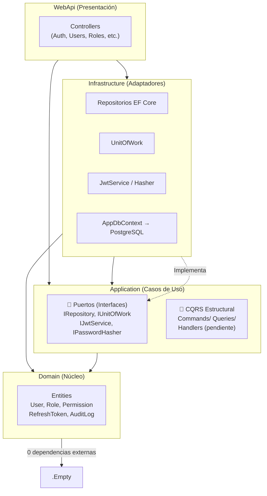

# User Management Platform

Plataforma de gestión de usuarios con autenticación JWT, RBAC, y despliegue Docker con Traefik.

## ⚠️ Regla de Oro

> **Ningún cambio debe aplicarse sin antes verificar explícitamente que la funcionalidad original tiene un test unitario que la cubra. Si no lo tiene, se debe crear el test, validar que funcione (dotnet test), y luego aplicar el cambio. Esto previene regresiones y asegura que el comportamiento original se preserve.**

## Stack

| Capa | Tecnología |
|------|-----------|
| Backend | .NET 10, C# 13, ASP.NET Core Minimal + Controllers |
| Arquitectura | Hexagonal (Domain/Application/Infrastructure/WebApi) |
| ORM | Entity Framework Core 10, PostgreSQL 18 |
| Autenticación | JWT (HS512) con refresh token rotation + reuse detection |
| Hashing | PBKDF2 (Rfc2898DeriveBytes, 100k iteraciones) |
| Frontend | React 19, Vite 8, TypeScript, Tailwind CSS v4, shadcn/ui v4 |
| Estado | Zustand |
| Validación (frontend) | React Hook Form + Zod |
| HTTP Client | Axios con interceptor de refresh automático |
| Proxy inverso | Traefik v3 con Let's Encrypt |
| Testing (backend) | xUnit + Moq + FluentAssertions |
| Contenedores | Docker Compose, imágenes Alpine multi-stage |

## Requisitos

- .NET 10 SDK
- Node.js 22+
- Docker + Docker Compose
- PostgreSQL 18 (o usar el contenedor del docker-compose)

## Inicio rápido (desarrollo local)

```bash
# 1. Clonar y configurar variables de entorno
cp .env.template .env
# Editar .env con valores reales
# La clave JWT debe tener al menos 64 caracteres

# 2. Configurar secretos locales (nunca en appsettings.json)
dotnet user-secrets init --project src/backend/AppBaseNetReact.WebApi
dotnet user-secrets set "Email:Smtp:Host" "smtp.gmail.com" --project src/backend/AppBaseNetReact.WebApi
dotnet user-secrets set "Email:Smtp:Username" "tu-email@gmail.com" --project src/backend/AppBaseNetReact.WebApi
dotnet user-secrets set "Email:Smtp:Password" "tu-passphrase" --project src/backend/AppBaseNetReact.WebApi
dotnet user-secrets set "Email:FromEmail" "tu-email@gmail.com" --project src/backend/AppBaseNetReact.WebApi
dotnet user-secrets set "FrontendUrl" "http://localhost:5173" --project src/backend/AppBaseNetReact.WebApi

# 3. Iniciar PostgreSQL (opcional, si no tienes local)
docker compose -f src/docker/docker-compose.yml up postgres -d

# 4. Backend (http://localhost:5011)
dotnet build AppBaseNetReact.slnx
dotnet run --project src/backend/AppBaseNetReact.WebApi

# 5. Frontend (http://localhost:5173)
cd src/frontend
npm install
npm run dev
```

## Diagrama de Arquitectura

> ⚠️ **Este diagrama debe mantenerse actualizado.** Cada vez que se modifique la estructura de capas, dependencias entre proyectos, o el flujo de ejecución, actualizar este diagrama en `README.md` y `AGENTS.md`.

### Dependencias entre Capas



### Flujo Actual vs Target

| Fase | ¿Quién orquesta? | ¿Dónde? |
|------|-----------------|---------|
| ⚡ **Actual** | Controller (via `IUnitOfWork`) | `WebApi/Controllers/*Controller.cs` |
| 🎯 **Target** | CQRS Handler (via MediatR) | `Application/Features/*/Commands|Queries/*Handler.cs` |

Actualmente los **Controllers** inyectan `IUnitOfWork` + servicios y ejecutan la lógica directamente. La carpeta `Application/Features/` tiene la estructura CQRS lista pero los handlers están vacíos — ese es el target arquitectónico.

## Estructura del proyecto

```
├── AppBaseNetReact.slnx          # Solución .NET (formato SLNX)
├── .env.template                # Template de variables de entorno
├── AGENTS.md                    # Guía multi-agente para asistentes IA
├── DESIGN.md                    # Architecture Decision Records (ADRs)
├── src/
│   ├── backend/
│   │   ├── AppBaseNetReact.Domain/       # Entidades, Value Objects, Enums (0 dependencias externas)
│   │   ├── AppBaseNetReact.Application/  # CQRS, Interfaces, Validación FluentValidation
│   │   ├── AppBaseNetReact.Infrastructure/ # EF Core Configurations, JWT, Email, Repositories
│   │   ├── AppBaseNetReact.WebApi/       # Controllers, Middleware, Program.cs, Filters
│   │   ├── AppBaseNetReact.Application.Tests/  # Unit tests — servicios, validadores
│   │   └── AppBaseNetReact.WebApi.Tests/       # Controller tests
│   ├── frontend/                       # React 19 + Vite 8
│   │   ├── src/stores/                 # Zustand (auth-store)
│   │   ├── src/lib/                    # API client (Axios), utils
│   │   ├── src/components/ui/          # shadcn/ui v4 primitives
│   │   ├── src/components/layout/      # Layout, Sidebar, Header
│   │   ├── src/components/auth/        # Auth guards (SessionWarning)
│   │   └── src/pages/                  # Login, Dashboard, Users, Roles, Permissions...
│   └── docker/                         # Dockerfiles, nginx.conf, docker-compose.yml
```

## API Endpoints

| Método | Ruta | Descripción | Auth |
|--------|------|-------------|------|
| POST | `/api/auth/login` | Inicio de sesión | No |
| POST | `/api/auth/refresh` | Refrescar token JWT | Refresh |
| POST | `/api/auth/change-password` | Cambiar contraseña | JWT |
| POST | `/api/auth/forgot-password` | Solicitar restablecimiento | No |
| POST | `/api/auth/reset-password` | Restablecer contraseña | Token |
| POST | `/api/auth/logout` | Cerrar sesión | JWT |
| GET | `/api/users` | Listar usuarios (paginado) | JWT |
| GET | `/api/users/{id}` | Obtener usuario | JWT |
| POST | `/api/users` | Crear usuario | JWT |
| PUT | `/api/users/{id}` | Actualizar usuario | JWT |
| DELETE | `/api/users/{id}` | Eliminar usuario (soft) | JWT |
| GET | `/api/roles` | Listar roles | JWT |
| GET | `/api/roles/{id}` | Obtener rol con permisos | JWT |
| POST | `/api/roles` | Crear rol | JWT |
| PUT | `/api/roles/{id}` | Actualizar rol | JWT |
| DELETE | `/api/roles/{id}` | Eliminar rol | JWT |
| GET | `/api/permissions` | Listar permisos | JWT |
| GET | `/api/dashboard/stats` | Estadísticas del dashboard | JWT |
| GET | `/scalar/v1` | Documentación interactiva API | No |

## Características de seguridad

- **JWT HS512** — Tokens de acceso de 15 min + refresh token de 7 días con rotación
- **Refresh Rotation** — Cada refresh invalida el token anterior; detecta reuso y revoca todas las sesiones
- **Rate Limiting** — 10 req/min en login, 3 req/h en forgot-password, 100 req/min global
- **Security Headers** — CSP, X-Frame-Options, X-Content-Type-Options, XSS-Protection, Referrer-Policy, Permissions-Policy
- **PBKDF2** — 100,000 iteraciones para hash de contraseñas (Rfc2898DeriveBytes)
- **Cuentas bloqueadas** — 5 intentos fallidos → bloqueo 15 min (HTTP 423)
- **Validación de contraseñas** — Servicio centralizado `PasswordPolicyService` con configuración vía `appsettings.json`

## Seed Data

Al iniciar por primera vez, el seeder crea:
- **22 permisos** cubriendo usuarios, roles, permisos, dashboard, admin, perfil
- **5 roles**: SuperAdmin, Admin, user-tipo-a, user-tipo-b, user-tipo-c
- **Usuario admin**: `admin` / `admin` (SuperAdmin — se exige cambiar contraseña en primer ingreso)

## Testing

```bash
# Ejecutar todos los tests
dotnet test AppBaseNetReact.slnx

# Ejecutar tests con cobertura
dotnet test AppBaseNetReact.slnx --collect:"XPlat Code Coverage"

# Tests por capa
dotnet test src/backend/AppBaseNetReact.Application.Tests
dotnet test src/backend/AppBaseNetReact.WebApi.Tests
```

Los tests siguen el patrón `[Clase]_[Método]_[Escenario]_[ResultadoEsperado]` con xUnit + Moq + FluentAssertions.

## Documentación de arquitectura

Ver [`DESIGN.md`](./DESIGN.md) para Architecture Decision Records (ADRs) detallados con contexto, opciones consideradas, decisión y trade-offs de cada elección técnica.

Ver [`AGENTS.md`](./AGENTS.md) para guías de workflow multi-agente.

## Variables de entorno

> ⚠️ **Datos sensibles y específicos del entorno nunca van en `appsettings.json`.**  
> Usar `dotnet user-secrets` en local o variables de entorno en Docker/despliegue.

| Variable | Descripción | Requerida |
|----------|-------------|-----------|
| `ConnectionStrings__PostgreSQL` | Cadena de conexión PostgreSQL | Sí |
| `Jwt__SecretKey` | Clave JWT (mínimo 64 caracteres para HS512) | Sí |
| `Jwt__Issuer` | Emisor del token | Sí |
| `Jwt__Audience` | Audiencia del token | Sí |
| `Captcha__SiteKey` | Cloudflare Turnstile Site Key | No |
| `Captcha__SecretKey` | Cloudflare Turnstile Secret Key | No |
| `Email__Smtp__Host` | Servidor SMTP (ej: `smtp.gmail.com`) | Sí |
| `Email__Smtp__Port` | Puerto SMTP (default: `587`) | No |
| `Email__Smtp__Username` | Usuario SMTP | Sí |
| `Email__Smtp__Password` | Contraseña o app password SMTP | Sí |
| `Email__FromEmail` | Dirección remitente | Sí |
| `Email__FromName` | Nombre remitente (default: `Sistema Gestión Usuarios`) | No |
| `FrontendUrl` | URL del frontend para enlaces en correos (ej: `http://localhost:5173`) | Sí |

## Comandos principales

```bash
# Backend
dotnet build AppBaseNetReact.slnx
dotnet watch run --project src/backend/AppBaseNetReact.WebApi

# Frontend
cd src/frontend && npm run dev
npm run build              # Producción

# Base de datos (EF Core)
dotnet ef migrations add <Nombre> --project src/backend/AppBaseNetReact.Infrastructure --startup-project src/backend/AppBaseNetReact.WebApi
dotnet ef database update --project src/backend/AppBaseNetReact.Infrastructure --startup-project src/backend/AppBaseNetReact.WebApi

# Docker (full stack con Traefik)
docker compose -f src/docker/docker-compose.yml --env-file .env build  # Construir todas las imágenes
docker compose -f src/docker/docker-compose.yml --env-file .env up -d
docker compose -f src/docker/docker-compose.yml --env-file .env down   # Detener todos los servicios
docker compose -f src/docker/docker-compose.yml --env-file .env down --volumes  # Detener + borrar volúmenes y redes (BD incluida)
```

## Despliegue

El archivo `src/docker/docker-compose.yml` levanta:
1. **Traefik** — Proxy reverso con TLS automático (Let's Encrypt)
2. **PostgreSQL 18** — Base de datos
3. **Backend** — .NET 10 Web API
4. **Frontend** — React SPA servido por Nginx

Para desplegar:

```bash
docker compose --env-file .env -f src/docker/docker-compose.yml up -d --build
```

Dominios por defecto (configurables en `.env`):
- Backend: (configurar dominio en producción)
- Frontend: (configurar dominio en producción)

### VPS con 1vCPU / 1GB RAM

Compilar .NET 10 en un VPS de 1GB RAM puede agotar la memoria y ralentizar el build. Se recomienda agregar swap:

```bash
sudo fallocate -l 2G /swapfile
sudo chmod 600 /swapfile
sudo mkswap /swapfile
sudo swapon /swapfile
# Persistente al reinicio:
echo '/swapfile none swap sw 0 0' | sudo tee -a /etc/fstab
```

Para verificar: `swapon --show` o `free -h`.

## Seed Data

Al iniciar por primera vez, el seeder crea:
- **22 permisos** cubriendo usuarios, roles, permisos, dashboard, admin, perfil
- **5 roles**: SuperAdmin, Admin, user-tipo-a, user-tipo-b, user-tipo-c
- **Usuario admin**: `admin` / `admin` (SuperAdmin — se exige cambiar contraseña en primer ingreso)
