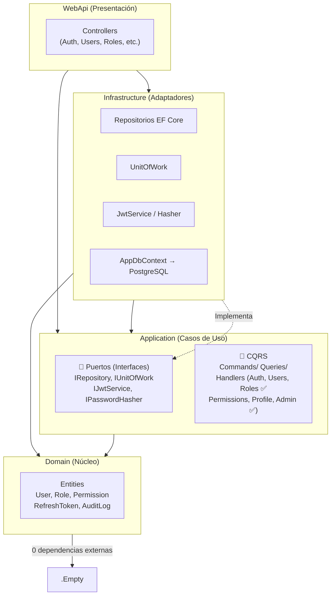

# User Management Platform

Plataforma de gestión de usuarios con autenticación JWT, RBAC, y despliegue Docker con Traefik.

## ⚠️ Regla de Oro

> **Ningún cambio debe aplicarse sin antes verificar explícitamente que la funcionalidad original tiene un test unitario que la cubra. Si no lo tiene, se debe crear el test, validar que funcione (dotnet test), y luego aplicar el cambio. Esto previene regresiones y asegura que el comportamiento original se preserve.**

## Stack

| Capa | Tecnología |
|------|-----------|
| Backend | .NET 10, C# 13, ASP.NET Core Minimal + Controllers |
| Arquitectura | Hexagonal (Domain/Application/Infrastructure/WebApi) |
| ORM | Entity Framework Core 10, PostgreSQL 18 |
| Autenticación | JWT (HS512) con refresh token rotation + reuse detection |
| Hashing | PBKDF2 (Rfc2898DeriveBytes, 100k iteraciones) |
| Frontend | React 19, Vite 8, TypeScript, Tailwind CSS v4, shadcn/ui v4 |
| Estado | Zustand |
| Validación (frontend) | React Hook Form + Zod |
| HTTP Client | Axios con interceptor de refresh automático |
| Proxy inverso | Traefik v3 con Let's Encrypt |
| Testing (backend) | xUnit + Moq + FluentAssertions |
| Contenedores | Docker Compose, imágenes Alpine multi-stage |

## Requisitos

- .NET 10 SDK
- Node.js 22+
- Docker + Docker Compose
- PostgreSQL 18 (o usar el contenedor del docker-compose)

## Inicio rápido (desarrollo local)

```bash
# 1. Clonar y configurar variables de entorno
cp .env.template .env
# Editar .env con valores reales
# La clave JWT debe tener al menos 64 caracteres

# 2. Configurar secretos locales (nunca en appsettings.json)
dotnet user-secrets init --project src/backend/AppBaseNetReact.WebApi
dotnet user-secrets set "Email:Smtp:Host" "smtp.gmail.com" --project src/backend/AppBaseNetReact.WebApi
dotnet user-secrets set "Email:Smtp:Username" "tu-email@gmail.com" --project src/backend/AppBaseNetReact.WebApi
dotnet user-secrets set "Email:Smtp:Password" "tu-passphrase" --project src/backend/AppBaseNetReact.WebApi
dotnet user-secrets set "Email:FromEmail" "tu-email@gmail.com" --project src/backend/AppBaseNetReact.WebApi
dotnet user-secrets set "FrontendUrl" "http://localhost:5173" --project src/backend/AppBaseNetReact.WebApi

# 3. Iniciar PostgreSQL (opcional, si no tienes local)
docker compose -f src/docker/docker-compose.yml up postgres -d

# 4. Backend (http://localhost:5011)
dotnet build AppBaseNetReact.slnx
dotnet run --project src/backend/AppBaseNetReact.WebApi

# 5. Frontend (http://localhost:5173)
cd src/frontend
npm install
npm run dev
```

## Diagrama de Arquitectura

> ⚠️ **Este diagrama debe mantenerse actualizado.** Cada vez que se modifique la estructura de capas, dependencias entre proyectos, o el flujo de ejecución, actualizar este diagrama en `README.md` y `AGENTS.md`.

### Dependencias entre Capas



### Estado CQRS

| ¿Quién orquesta? | ¿Dónde? |
|-----------------|---------|
| ✅ CQRS Handler (via MediatR) | `Application/Features/*/Commands\|Queries/*Handler.cs` |

Todos los controladores están migrados a CQRS: inyectan solo `IMediator` y delegan la lógica de negocio a handlers en `Application/Features/` (Auth, Users, Roles, Permissions, Profile, Admin).

## Estructura del proyecto

```
├── AppBaseNetReact.slnx          # Solución .NET (formato SLNX)
├── .env.template                # Template de variables de entorno
├── AGENTS.md                    # Guía multi-agente para asistentes IA
├── DESIGN.md                    # Architecture Decision Records (ADRs)
├── src/
│   ├── backend/
│   │   ├── AppBaseNetReact.Domain/       # Entidades, Value Objects, Enums (0 dependencias externas)
│   │   ├── AppBaseNetReact.Application/  # CQRS, Interfaces, Validación FluentValidation
│   │   ├── AppBaseNetReact.Infrastructure/ # EF Core Configurations, JWT, Email, Repositories
│   │   ├── AppBaseNetReact.WebApi/       # Controllers, Middleware, Program.cs, Filters
│   │   ├── AppBaseNetReact.Application.Tests/  # Unit tests — servicios, validadores
│   │   └── AppBaseNetReact.WebApi.Tests/       # Controller tests
│   ├── frontend/                       # React 19 + Vite 8
│   │   ├── src/stores/                 # Zustand (auth-store)
│   │   ├── src/lib/                    # API client (Axios), utils
│   │   ├── src/components/ui/          # shadcn/ui v4 primitives
│   │   ├── src/components/layout/      # Layout, Sidebar, Header
│   │   ├── src/components/auth/        # Auth guards (SessionWarning)
│   │   └── src/pages/                  # Login, Dashboard, Users, Roles, Permissions...
│   └── docker/                         # Dockerfiles, nginx.conf, docker-compose.yml
```

## API Endpoints

| Método | Ruta | Descripción | Auth |
|--------|------|-------------|------|
| POST | `/api/auth/login` | Inicio de sesión | No |
| POST | `/api/auth/refresh` | Refrescar token JWT | Refresh |
| POST | `/api/auth/change-password` | Cambiar contraseña | JWT |
| POST | `/api/auth/forgot-password` | Solicitar restablecimiento | No |
| POST | `/api/auth/reset-password` | Restablecer contraseña | Token |
| POST | `/api/auth/logout` | Cerrar sesión | JWT |
| GET | `/api/users` | Listar usuarios (paginado) | JWT |
| GET | `/api/users/{id}` | Obtener usuario | JWT |
| POST | `/api/users` | Crear usuario | JWT |
| PUT | `/api/users/{id}` | Actualizar usuario | JWT |
| DELETE | `/api/users/{id}` | Eliminar usuario (soft) | JWT |
| GET | `/api/roles` | Listar roles | JWT |
| GET | `/api/roles/{id}` | Obtener rol con permisos | JWT |
| POST | `/api/roles` | Crear rol | JWT |
| PUT | `/api/roles/{id}` | Actualizar rol | JWT |
| DELETE | `/api/roles/{id}` | Eliminar rol | JWT |
| GET | `/api/permissions` | Listar permisos | JWT |
| GET | `/api/dashboard/stats` | Estadísticas del dashboard | JWT |
| GET | `/scalar/v1` | Documentación interactiva API | No |

## Acceso a Base de Datos (Seguro)

> ⚠️ **Nunca expongas PostgreSQL directamente a internet.** Usa siempre un túnel SSH o la API REST.

### Vía túnel SSH (recomendado para administración)

```bash
# 1. Túnel SSH — puerto local 5433 → Postgres del servidor
ssh -i "ruta/a/tu-key" -L 5433:localhost:5432 usuario@IP-DEL-SERVIDOR -N

# 2. Conectar a localhost:5433 con cualquier cliente
psql -h localhost -p 5433 -U mvp-usuarios-db -d mvp-usuarios-db
```

**Requisitos**: Llave SSH configurada, contenedor Postgres corriendo en el servidor, puerto 5432 no expuesto al firewall público.

### Vía API REST (recomendado para aplicaciones)

El backend expone endpoints seguros con autenticación JWT. Ejemplo:

```bash
# Obtener token
curl -s https://api.tudominio.cl/api/auth/login \
  -H "Content-Type: application/json" \
  -d '{"email":"admin@sistema.local","password":"admin"}'

# Consultar datos (reemplaza <token> con el JWT recibido)
curl -s https://api.tudominio.cl/api/users \
  -H "Authorization: Bearer <token>"
```

**Ventajas**: Autenticación JWT, rate limiting, auditoría, sin exponer credenciales de DB.

## Características de seguridad

- **JWT HS512** — Tokens de acceso de 15 min + refresh token de 7 días con rotación
- **Refresh Rotation** — Cada refresh invalida el token anterior; detecta reuso y revoca todas las sesiones
- **Rate Limiting** — 10 req/min en login, 3 req/h en forgot-password, 100 req/min global
- **Security Headers** — CSP, X-Frame-Options, X-Content-Type-Options, XSS-Protection, Referrer-Policy, Permissions-Policy
- **PBKDF2** — 100,000 iteraciones para hash de contraseñas (Rfc2898DeriveBytes)
- **Cuentas bloqueadas** — 5 intentos fallidos → bloqueo 15 min (HTTP 423)
- **Validación de contraseñas** — Servicio centralizado `PasswordPolicyService` con configuración vía `appsettings.json`

## Seed Data

Al iniciar por primera vez, el seeder crea:
- **22 permisos** cubriendo usuarios, roles, permisos, dashboard, admin, perfil
- **5 roles**: SuperAdmin, Admin, user-tipo-a, user-tipo-b, user-tipo-c
- **Usuario admin**: `admin` / `admin` (SuperAdmin — se exige cambiar contraseña en primer ingreso)

## Testing

```bash
# Ejecutar todos los tests
dotnet test AppBaseNetReact.slnx

# Ejecutar tests con cobertura
dotnet test AppBaseNetReact.slnx --collect:"XPlat Code Coverage"

# Tests por capa
dotnet test src/backend/AppBaseNetReact.Application.Tests
dotnet test src/backend/AppBaseNetReact.WebApi.Tests
```

Los tests siguen el patrón `[Clase]_[Método]_[Escenario]_[ResultadoEsperado]` con xUnit + Moq + FluentAssertions.

## Documentación de arquitectura

Ver [`DESIGN.md`](./DESIGN.md) para Architecture Decision Records (ADRs) detallados con contexto, opciones consideradas, decisión y trade-offs de cada elección técnica.

Ver [`AGENTS.md`](./AGENTS.md) para guías de workflow multi-agente.

## Variables de entorno

> ⚠️ **Datos sensibles y específicos del entorno nunca van en `appsettings.json`.**  
> Usar `dotnet user-secrets` en local o variables de entorno en Docker/despliegue.

| Variable | Descripción | Requerida |
|----------|-------------|-----------|
| `ConnectionStrings__PostgreSQL` | Cadena de conexión PostgreSQL | Sí |
| `Jwt__SecretKey` | Clave JWT (mínimo 64 caracteres para HS512) | Sí |
| `Jwt__Issuer` | Emisor del token | Sí |
| `Jwt__Audience` | Audiencia del token | Sí |
| `Captcha__SiteKey` | Cloudflare Turnstile Site Key | No |
| `Captcha__SecretKey` | Cloudflare Turnstile Secret Key | No |
| `Email__Smtp__Host` | Servidor SMTP (ej: `smtp.gmail.com`) | Sí |
| `Email__Smtp__Port` | Puerto SMTP (default: `587`) | No |
| `Email__Smtp__Username` | Usuario SMTP | Sí |
| `Email__Smtp__Password` | Contraseña o app password SMTP | Sí |
| `Email__FromEmail` | Dirección remitente | Sí |
| `Email__FromName` | Nombre remitente (default: `Sistema Gestión Usuarios`) | No |
| `FRONTEND_DOMAIN` | Dominio del frontend para enlaces en correos y redirect OAuth (ej: `app.example.com`). En desarrollo se usa `localhost:5173` | No |

## Comandos principales

```bash
# Backend
dotnet build AppBaseNetReact.slnx
dotnet watch run --project src/backend/AppBaseNetReact.WebApi

# Frontend
cd src/frontend && npm run dev
npm run build              # Producción

# Base de datos (EF Core)
dotnet ef migrations add <Nombre> --project src/backend/AppBaseNetReact.Infrastructure --startup-project src/backend/AppBaseNetReact.WebApi
dotnet ef database update --project src/backend/AppBaseNetReact.Infrastructure --startup-project src/backend/AppBaseNetReact.WebApi

# Docker (full stack con Traefik)
docker compose -f src/docker/docker-compose.yml --env-file .env build  # Construir todas las imágenes
docker compose -f src/docker/docker-compose.yml --env-file .env up -d # Despliega la aplicacion
docker compose -f src/docker/docker-compose.yml --env-file .env up -d --build # Construye y depliega la aplicacion.
docker compose -f src/docker/docker-compose.yml --env-file .env down   # Detener todos los servicios
docker compose -f src/docker/docker-compose.yml --env-file .env down --volumes  # Detener + borrar volúmenes y redes (BD incluida)
```

## Sincronización de Historial (en caso de Git Force Push)

Si el historial del repositorio ha sido reescrito (por ejemplo, al purgar archivos sensibles con un `git push --force`), las máquinas con clones locales existentes no deben usar `git pull` directamente para evitar duplicar commits y generar conflictos masivos.

Para sincronizar de forma segura en otra máquina manteniendo intactos tus archivos locales no trackeados (como tu archivo `.env`):

```bash
# 1. Descargar la última información del servidor remoto
git fetch origin

# 2. Alinear la rama local exactamente con la versión remota
git reset --hard origin/main
```

> [!IMPORTANT]
> El comando `git reset --hard` descarta cualquier cambio local no confirmado en archivos controlados por Git. Si tienes cambios de código que no quieres perder, guárdalos en un stash (`git stash`) antes de ejecutar el reset. Los archivos no trackeados e ignorados (como el archivo `.env`) **no se perderán ni se sobrescribirán**.

## Despliegue

El archivo `src/docker/docker-compose.yml` levanta:
1. **Traefik** — Proxy reverso con TLS automático (Let's Encrypt)
2. **PostgreSQL 18** — Base de datos
3. **Backend** — .NET 10 Web API
4. **Frontend** — React SPA servido por Nginx

Para desplegar:

```bash
docker compose --env-file .env -f src/docker/docker-compose.yml up -d --build
```

Dominios por defecto (configurables en `.env`):
- Backend: (configurar dominio en producción)
- Frontend: (configurar dominio en producción)

### VPS con 1vCPU / 1GB RAM

Compilar .NET 10 en un VPS de 1GB RAM puede agotar la memoria y ralentizar el build. Se recomienda agregar swap:

```bash
sudo fallocate -l 2G /swapfile
sudo chmod 600 /swapfile
sudo mkswap /swapfile
sudo swapon /swapfile
# Persistente al reinicio:
echo '/swapfile none swap sw 0 0' | sudo tee -a /etc/fstab
```

Para verificar: `swapon --show` o `free -h`.

## Seed Data

Al iniciar por primera vez, el seeder crea:
- **23 permisos** cubriendo usuarios, roles, permisos, dashboard, admin, perfil, página pública
- **6 roles**: SuperAdmin, Admin, user-tipo-a, user-tipo-b, user-tipo-c, public
- **Usuario admin**: `admin` / `admin` (SuperAdmin — se exige cambiar contraseña en primer ingreso)

## Google OAuth 2.0 — Configuración

La plataforma soporta login con Google OAuth2 (Authorization Code Flow). Los usuarios nuevos se registran automáticamente con el rol `public` y el campo `RegistrationSource` queda marcado como `"google"` para trazabilidad.

### Requisitos

- Una cuenta de Google (gratuita, personal — no requiere Google Workspace)
- Acceso a [Google Cloud Console](https://console.cloud.google.com)

### Paso a paso: Crear credenciales OAuth 2.0

1. **Ir a Google Cloud Console**
   - Navega a [https://console.cloud.google.com/apis/credentials](https://console.cloud.google.com/apis/credentials)
   - Inicia sesión con tu cuenta de Google

2. **Crear o seleccionar un proyecto**
   - Si no tienes uno, haz clic en el selector de proyectos (arriba a la izquierda) y selecciona "Nuevo proyecto"
   - Asígnale un nombre (ej. "MVP-Usuarios-OAuth")
   - Espera a que se cree y selecciona el proyecto

3. **Configurar la pantalla de consentimiento OAuth**
   - En el menú lateral: "APIs & Services" → "OAuth consent screen"
   - User Type: selecciona **"External"** (es la opción para cuentas personales/gratuitas)
   - Haz clic en "Create"
   - **App name**: "MVP Usuarios" (o el nombre que quieras)
   - **User support email**: tu correo
   - **Developer contact information**: tu correo
   - Haz clic en "Save and Continue"
   - **Scopes**: no es necesario agregar scopes adicionales (usamos `openid`, `email`, `profile` que vienen por defecto)
   - Haz clic en "Save and Continue"
   - **Test users**: haz clic en "ADD USERS" y agrega tu correo (mientras la app está en estado "Testing", solo los usuarios que agregues aquí podrán autenticarse)
   - Haz clic en "Save and Continue"
   - Revisa el resumen y haz clic en "Back to Dashboard"

   > **Nota:** Como la app está en estado "Testing", no requiere verificación de Google. Es suficiente para desarrollo y aprendizaje. Cuando quieras publicarla, puedes solicitar verificación o cambiar a "Production", pero para uso personal/aprendizaje el estado "Testing" es adecuado.

4. **Crear credenciales OAuth 2.0**
   - En el menú lateral: "APIs & Services" → "Credentials"
   - Haz clic en "+ Create Credentials" → "OAuth client ID"
   - **Application type**: "Web application"
   - **Name**: "MVP-Usuarios-WebApp"
   - **Authorized JavaScript origins**:
     - `http://localhost:5173` (desarrollo)
     - `https://front.example.com` (producción — ejemplo)
   - **Authorized redirect URIs**:
     - `http://localhost:5011/api/auth/google/callback` (desarrollo)
     - `https://back.example.com/api/auth/google/callback` (producción — ejemplo)
   - Haz clic en "Create"

5. **Copiar credenciales**
   - Anota el **Client ID** y el **Client Secret** que Google te muestra
   - Estos valores van en tu `.env` o en los secretos de la aplicación

    > ⚠️ **Importante:** El Client Secret es sensible — nunca lo compartas ni lo subas al repositorio.

### Configurar variables de entorno

Agrega las siguientes variables a tu `.env` (o usa `dotnet user-secrets`):

```bash
dotnet user-secrets set "Authentication:Google:ClientId" "tu-client-id.apps.googleusercontent.com" --project src/backend/AppBaseNetReact.WebApi
dotnet user-secrets set "Authentication:Google:ClientSecret" "tu-client-secret" --project src/backend/AppBaseNetReact.WebApi
dotnet user-secrets set "Authentication:Google:RedirectUri" "http://localhost:5011/api/auth/google/callback" --project src/backend/AppBaseNetReact.WebApi
```

O directamente en `.env` (copiado desde `.env.template`):

```env
Authentication__Google__ClientId=tu-client-id.apps.googleusercontent.com
Authentication__Google__ClientSecret=tu-client-secret
Authentication__Google__RedirectUri=http://localhost:5011/api/auth/google/callback
```

### Verificar que funciona

1. Inicia la aplicación (backend + frontend)
2. Ve a `http://localhost:5173/login`
3. Haz clic en "Continuar con Google"
4. Serás redirigido a Google para autorizar
5. Después de autorizar, serás redirigido de vuelta y verás el mensaje de bienvenida en `/publico`

### Notas importantes

- El rol `public` se asigna automáticamente solo a usuarios nuevos (primer login con Google)
- Si un usuario ya existe con el mismo email (registrado por password), se vincula la cuenta de Google y NO se asigna el rol `public`
- Los usuarios creados por Google OAuth no tienen contraseña (no pueden usar el login por email/password)
- El campo `RegistrationSource` queda marcado como `"google"` en la base de datos para trazabilidad

### Despliegue en producción

Al publicar la aplicación en un servidor, es necesario verificar el dominio y actualizar las URLs:

1. **Verificar el dominio en Google Search Console**
   - Ve a [https://search.google.com/search-console](https://search.google.com/search-console)
   - Agrega tu dominio como propiedad (ej. `https://example.com`)
   - Sigue el método de verificación que prefieras (TXT record en DNS, archivo HTML, etc.)
   - Repite para cada subdominio que uses (ej. `https://front.example.com`, `https://back.example.com`)

2. **Actualizar Google Cloud Console**
   - En **OAuth consent screen**: cambia la **Homepage URL** a tu dominio de frontend (`https://front.example.com`)
   - En **Credentials** → tu OAuth Client ID:
     - Agrega `https://front.example.com` en **Authorized JavaScript origins**
     - Agrega `https://back.example.com/api/auth/google/callback` en **Authorized redirect URIs**

3. **Configurar variables de entorno en producción**

   En tu `.env` (o en el entorno del servidor):
   ```env
   Authentication__Google__ClientId=tu-client-id.apps.googleusercontent.com
   Authentication__Google__ClientSecret=tu-client-secret
   Authentication__Google__RedirectUri=https://back.example.com/api/auth/google/callback
   ```

4. **Docker Compose** — Asegúrate de que estas variables se pasen al contenedor backend (ver `src/docker/docker-compose.yml`):
   ```yaml
   environment:
     Authentication__Google__ClientId: ${Authentication__Google__ClientId:?}
     Authentication__Google__ClientSecret: ${Authentication__Google__ClientSecret:?}
     Authentication__Google__RedirectUri: ${Authentication__Google__RedirectUri:?}
     FRONTEND_DOMAIN: ${FRONTEND_DOMAIN:?Debe definir FRONTEND_DOMAIN en .env}
   ```

### Solución de problemas — Google

| Problema | Causa posible | Solución |
|----------|--------------|----------|
| "Error: Invalid state parameter" | Cookies deshabilitadas o sesión expirada | Recargar la página e intentar de nuevo |
| "Error: Google authentication failed" | Client ID/Secret incorrectos | Verificar las credenciales en `.env` |
| "Error: access_denied" | Usuario no agregado a Test users | Ir a OAuth consent screen y agregar el email |
| 400 Bad Request en callback | Redirect URI no coincide | Verificar que coincida exactamente la URL en Google Console y en la configuración |
| `invalid_request` / `flowName=GeneralOAuthFlow` | Redirect URI de producción no registrado en Google Console | Agregar `https://back.example.com/api/auth/google/callback` en Credentials → Authorized redirect URIs |
| "El sitio web no está registrado a tu nombre" | Dominio no verificado en Google Search Console | Verificar el dominio en [Search Console](https://search.google.com/search-console) |
| Error 403 después del callback | CORS: frontend no autorizado | Agregar el dominio del frontend en `Authorized JavaScript origins` y en `Cors:AllowedOrigins` |
| Las variables Google no se cargan en Docker | `docker-compose.yml` no pasa las env vars | Agregar `Authentication__Google__*` al `environment` del servicio `backend` |
| Google redirige a `localhost:5173` tras autorizar | `FRONTEND_DOMAIN` no se pasa al contenedor backend | Agregar `FRONTEND_DOMAIN` al `environment` del servicio `backend` en `docker-compose.yml` |

## GitHub OAuth 2.0 — Configuración

La plataforma soporta login con GitHub OAuth2 (Authorization Code Flow). Los usuarios nuevos se registran automáticamente con el rol `public` y el campo `RegistrationSource` queda marcado como `"github"` para trazabilidad.

### Requisitos

- Una cuenta de GitHub (gratuita, personal — no requiere GitHub Enterprise)
- Acceso a [GitHub Settings > Developer settings](https://github.com/settings/developers)

### Paso a paso: Crear OAuth App en GitHub

1. **Ir a GitHub Developer Settings**
   - Navega a [https://github.com/settings/developers](https://github.com/settings/developers)
   - En el menú lateral: **OAuth Apps**
   - Haz clic en **"New OAuth App"** (o **"Register a new application"**)

2. **Completar el formulario de registro**

   | Campo | Valor (desarrollo) | Valor (producción — ejemplo) |
   |-------|-------------------|------------------------------|
   | **Application name** | `AppBaseNetReact` | `AppBaseNetReact` |
   | **Homepage URL** | `http://localhost:5173` | `https://front.example.com` |
   | **Application description** | *(opcional)* | *(opcional)* |
   | **Authorization callback URL** | `http://localhost:5011/api/auth/github/callback` | `https://back.example.com/api/auth/github/callback` |

   > ⚠️ **La Authorization callback URL debe coincidir exactamente** con la configurada en `Authentication:GitHub:RedirectUri`. GitHub valifica esta URL estrictamente.

3. **Haz clic en "Register application"**

4. **Copiar credenciales**
   - Anota el **Client ID** (visible en la página de la app)
   - Haz clic en **"Generate a new client secret"** y copia el **Client Secret**

    > ⚠️ **Importante:** El Client Secret es sensible — nunca lo compartas ni lo subas al repositorio. GitHub solo lo muestra una vez; si lo pierdes, debes generar uno nuevo.

### Configurar variables de entorno

Agrega las siguientes variables a tu `.env` (o usa `dotnet user-secrets`):

```bash
dotnet user-secrets set "Authentication:GitHub:ClientId" "tu-client-id" --project src/backend/AppBaseNetReact.WebApi
dotnet user-secrets set "Authentication:GitHub:ClientSecret" "tu-client-secret" --project src/backend/AppBaseNetReact.WebApi
dotnet user-secrets set "Authentication:GitHub:RedirectUri" "http://localhost:5011/api/auth/github/callback" --project src/backend/AppBaseNetReact.WebApi
```

O directamente en `.env` (copiado desde `.env.template`):

```env
Authentication__GitHub__ClientId=tu-client-id
Authentication__GitHub__ClientSecret=tu-client-secret
Authentication__GitHub__RedirectUri=http://localhost:5011/api/auth/github/callback
```

### Verificar que funciona

1. Inicia la aplicación (backend + frontend)
2. Ve a `http://localhost:5173/login`
3. Haz clic en **"Continuar con GitHub"**
4. Serás redirigido a GitHub para autorizar (solicita permisos de `read:user` y `user:email`)
5. Después de autorizar, serás redirigido de vuelta y verás el mensaje de bienvenida en `/publico`

### Diferencias con Google OAuth

| Aspecto | Google OAuth | GitHub OAuth |
|---------|-------------|--------------|
| **Protocolo** | OpenID Connect (ID token JWT) | OAuth2 estándar (sin OpenID) |
| **Email** | Siempre disponible (scope `openid email`) | Puede ser privado; se solicita scope `user:email` y API adicional |
| **Nombre** | `given_name` + `family_name` | `name` (puede ser null; fallback a `login`) |
| **Verificación** | Google Cloud Console (estado Testing) | Sin verificación — todas las apps funcionan inmediatamente |

### Notas importantes

- El rol `public` se asigna automáticamente solo a usuarios nuevos (primer login con GitHub)
- Si un usuario ya existe con el mismo email (registrado por password o Google), se vincula la cuenta de GitHub y NO se asigna el rol `public`
- Los usuarios creados por GitHub OAuth no tienen contraseña (no pueden usar el login por email/password)
- El campo `RegistrationSource` queda marcado como `"github"` en la base de datos para trazabilidad
- GitHub puede no exponer el email del usuario si está configurado como privado; en ese caso se usa `{login}@github.local` como email de respaldo

### Solución de problemas — GitHub

| Problema | Causa posible | Solución |
|----------|--------------|----------|
| "Error: github_auth_failed" | Client ID/Secret incorrectos | Verificar las credenciales en `.env` |
| "Error: Invalid state parameter" | Sesión expirada o cookies deshabilitadas | Recargar la página e intentar de nuevo |
| `redirect_uri_mismatch` | La callback URL no coincide exactamente | Verificar que coincida exactamente en GitHub OAuth App y en la configuración |
| `application_suspended` | La app fue suspendida por GitHub | Ir a GitHub OAuth Apps y verificar el estado de la aplicación |
| El usuario no aparece en `/publico` | Email privado generó `@github.local` | El usuario puede actualizar su email en la página de perfil |
